# Anatomy of a Good Pull Request

---

# Who am I?

- Sean Griffin (@sgrif)
- 10x Hacker Ninja Guru at Shopify
- Rails Committer
- Maintainer of Active Record
- Creator of Diesel
- Bikeshed co-host

^ Hello, my name is Sean Griffin. I am paid by Shopify to work full time on open source -- Mainly focusing on Ruby on Rails. If we've interacted in the past, there's a good chance it looked like this:

---

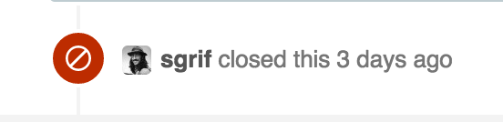

^ I close *a lot* of pull requests. In fact, I originally wanted to call this talk:

---

# Why I Closed Your Pull Request

^ But that gives the wrong tone. It's not about me, it's about how you can have a bigger impact when you contribute to open source. Today I'm going to show you how to submit higher quality pull requests, when submitting to Rails or any other open source project.

---

# We're going to look at several real world examples

^ I'm going to be showing several examples in this talk. I've done my best to remove any identifying information of people that aren't on the Rails team. You could probably find these pull requests if you really tried.

---

# Please be respectful

^ Please don't do that, and respect the privacy of these people.

---

# Let's start with the prerequisites

^ So let's start with the bare minimum of what you should do before submitting a PR. I'm not going to spend much time on these, as there's not a ton to say on the matter

---

# Read the CONTRIBUTING file

^ I should also point out that it's not just about reading it, but doing what it says...  

---

# Write code that you're proud of

^ The code should be quality code. Remember that you're not just writing code for yourself. Someone else has to maintain it.

---

# Have tests for
# your change

^ If you don't have tests, add tests. If the change doesn't require tests, more often than not it's not a change worth submitting. If you've written a solid refactoring that improves the quality of the code without a change in behavior, that's fine. More often changes that don't have tests are something like renaming a variable, which usually isn't worth the price of the git churn it causes unless the surrounding code is already changing.

---

# Follow the
# style guide

---

# Before opening a pull request

- Read the CONTRIBUTING file
- Write code that you're proud of
- Have tests for your change
- Follow the style guide

^ Here's the one slide so you can take a picture and make me sound smart in a tweet. So this is the bare minimum. If you haven't done these things before submitting, do these things -- End of story. Now let's talk about things that are a little more subtle

---

# Pull requests are not about code

^ I think a common misconception is that pull requests are about code. The code should speak for itself and stand on its own. But this just isn't true.

---

# A pull request is a sales pitch

^ A pull request is a sales pitch. Your job is to convince the project maintainers why your patch should be merged. There's a few aspects to that.

---

# Make it easy to review

^ The first is that you want to make it easy to review. First and foremost that means keeping the size reasonable. Nobody wants to review a pull request that looks like this:

---


^ This amount of code would take days to review. It's more likely to sit at the back of the backlog until there's nothing else to review (and there's always something else to review). My most well known contribution to Rails was originally a PR with over a thousand lines changed.

^ If your pull request is too large, consider doing what I did. Find smaller pieces that you can break apart, and submit them separately. If you've given the maintainers context about the larger change you're trying to make, saying "this is a refactoring in support of X" is usually enough

^ And if your change is large enough that this is even a consideration, please talk to the maintainers before doing the work. Make sure it's a change that they want to have made, and keep them in the loop about context.

---

# Don't assume
# we have context

^ Another way you can make your PR easier to review is to make sure that all the context needed to understand the problem is right there. Include links to other relevant sources. If it's a bug fix, link to the original issue. If you're adding support for some PostgreSQL feature to an ORM, link to the page in the PG docs describing it. If you're making sure a web framework conforms to some RFC, link to the relevant section of the RFC.

^ It's also worth linking to prior commits in the related code (in particular, including a link to the commit which introduced the bug is almost always helpful). Explain why the problem occurred. Don't assume that a maintainer already knows about the feature you're trying to add or the problem you're trying to fix. It takes an extra 5 minutes, but will make a world of difference to the reviewer.

---

# Convince us why the problem matters

^ You also shouldn't assume that the problem you're solving speaks for itself. Sometimes it's more clear cut. For example, if I had a library for adding padding to the beginning of strings, because that's totally something that should be a library...

---

# (lol `left_pad` joke)

---

# Convince us why the problem matters

^ And that library segfaulted when the string isn't unicode or something, then yeah that's a pretty clear cut bug. But often times the line between bug and feature is a lot more blurry. Or the change just introduces too much complexity to justify the cost.

^ And there's a lot of things that we consider when deciding whether to make a change

---

# How many users are affected?

---

# How complex
# is the fix?

^ Open source maintainers aren't magic. And the same laws that apply to app code apply to open source code. Adding complexity means that it's more likely that additional bugs will be introduced in the future. Adding complexity makes the code harder to understand, and makes it harder to onboard new contributors.

---

# Is the fix a change in behavior?

^ Stability is a big deal to open source maintainers. Just because a bug exists doesn't always mean it should be fixed. In many cases bugs can turn into defacto features. Here's an example

---

```ruby
class User < ActiveRecord::Base
  has_many :posts, -> { order(:title) }
  has_many :comments, through: :posts
end

class Post
  has_many :comments, -> { order(:text) }
end
```

^ Now I know not everyone here uses Rails so let me walk you through this. Active Record is our library for database persistence. Explain code

^ Now the problem is when we access the comments from the user, we apply the comments order first and then the posts order. So the posts title will override the comment body, which is really weird and confusing and I'm can't change it. I *hate* having this interaction:

---

> You're 100% right, I agree with you. But I'm closing your pull request.
-- The most frustrating interaction in Open Source

^ The person is right. Their change was fine. The resulting behavior would be better. But that's not the only consideration. I'm not going to make a breaking change to behavior that has been that way for a decade, especially when I know a lot of code is relying on it.

---

# Could that change introduce subtle bugs?

^ If the fix does change the behavior, what happens to someone relying on the old behavior? Does it blow up? Or does it silently do the wrong thing?

---

# Is it possible to deprecate the old behavior first?

^ Can we detect if they were relying on the old behavior and introduce a deprecation warning? It's always more likely that a change will be accepted in that case.

---

# How easy is it to work around the problem?

^ At the end of the day, if a bug only impacts a handful of people, where the workaround is easy and the fix has a lot of complexity, it might just be better not to merge it.

---

# Show us that your change is the best solution

---

# You are not entitled to having your pull request merged

^ In open source we sometimes talk about whether something is free as in beer or free as in speech. Well a pull request is neither. A pull request is free as in puppy.

---

# Free as in puppy

^ Ultimately your change is something the project will have to maintain for the foreseeable future.

---

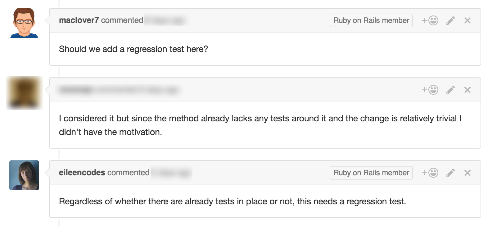

---

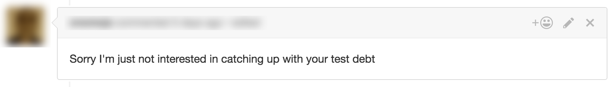

^ "Ok, well sorry maybe I'm just not interested in accepting your patch." In this case they eventually did add a test, and ended up editing that comment to be less nasty. All was good, and the change was eventually merged. But it's important to keep in mind that when you submit a pull request to a project, here's what you're actually saying

---

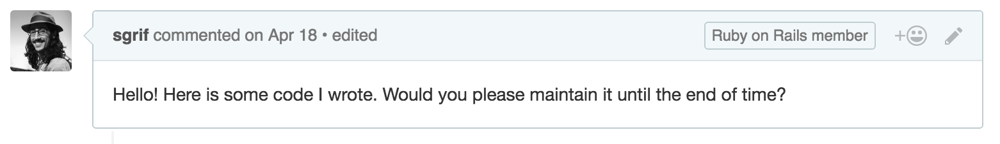

---

# Most patch authors won't stick around

^ More than half of the 2400 people who have committed to Rails have 3 or less commits. I'm sure the percentage is even larger if I exclude doc changes.

^ At the end of the day, the person who will be maintaining the code that you submit isn't you, it's the project owners. Even if you fully intend to help maintain the code you wrote, it's not an assumption that we can make, and we're going to assume that you won't. That means that it's important to be picky about what patches are accepted, especially if it's adding a new feature.

---

# Features are easy to add, but hard to remove

^ Since most often we'll only see one or two pull requests from a person, I usually prefer to see good commit messages that contain a lot of context.

---

# Give context in the commit message

^ This is the most convenient place to brief someone on your change, including the reviewer. I recently had a pull request where this was the entire commit message:

---

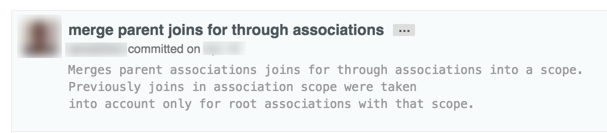

^ That commit mostly touched code that I wrote or am familiar with, and I'm still not entirely sure what it meant. The code change didn't offer much explanation either. You may be wondering I care so much about commit messages. It's the main way I communicate with most people.

---

# `git blame`

^ Whenever I'm looking at some code and don't quite get why something is that way, or I need a question answered, the first thing I'll do is git blame and read the commit message. blame is also a terrible name for that tool.

---

# ~~`git blame`~~
# `git context`

^ But the important thing is that you should document all the context you can in the commit message. After all, this isn't for you, it's for other people. Although other people includes you next week.

---

# Write longer commit messages

^ I don't care about what or how, the commit message should talk about why. Why did this change get made? Why did you do it this way? Why didn't you do it another way? What else went through your head that might be useful? I don't have a hard rule for how long a commit message should be, but if you're wondering if it's too long the answer is no. Here's an example of one of my commits from about a year ago:

---

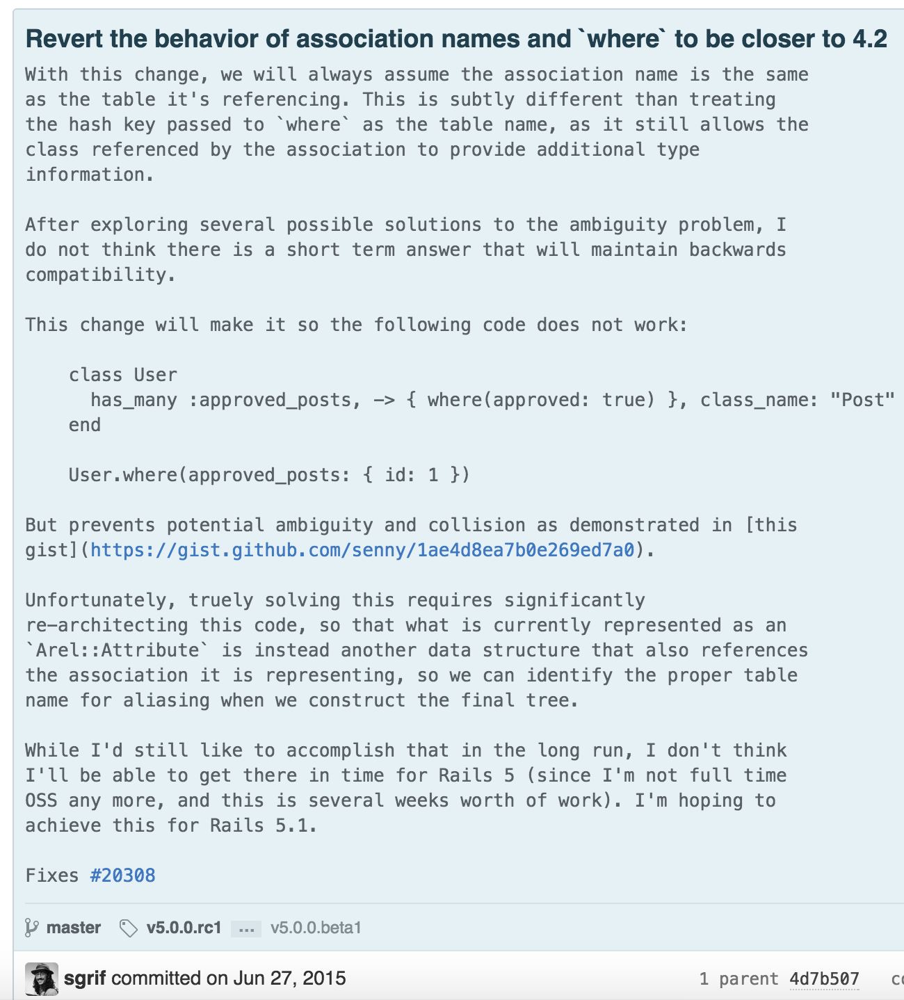

^ I doubt you can read that, but you don't need to. What's important is that this is 9 paragraphs with some code examples. This is probably a huge change, right?

---

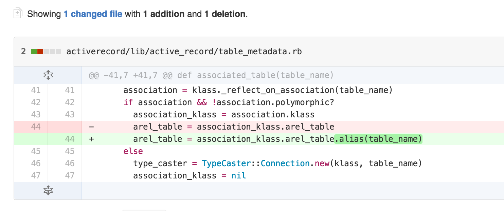

^ If by long you mean one line, then yes. But this change had a huge impact. It turns out that the amount of context available isn't related to lines of code changed. While we're on the subject of committing habits, here's a few other tips

---

# Keep your commits separate during code review

^ We will eventually want them down to a single commit before we merge, but during code review it's best to keep them separate so we can easily see what changed. Some projects will be fine with you keeping them separate forever. If you're submitting to Rails, we'll usually ask you to squash and rebase before we merge.

---

# Amend your commit message when squashing

^ If there's been more than one commit, there was likely important context that came up during the discussion. Document it when you squash it, since that's where future people will be looking for it.

---

# Don't rely on GitHub to store your context

^ Some people will argue that you don't need to put discussion from the pull request in the commit because it's in GitHub. I'd rather have it stored somewhere that multiple people have local copies, and where I can access it on a plane.

^ Hey was anyone here at RailsConf?

---

# [fit] 5

---

# Don't drive-by commit

^ The easiest way to get us to start assuming you'll be around to help maintain your code is to come back for more than one commit. And this isn't just about maintenance. This is a theory that I have based on my personal experience, that sounds a bit harsh...

---

# Your third pull request is when you really start to make an impact

^ What I've found is that more often than not, if I'm reviewing someone's first or second pull request, it takes more time to review it and work with the submitter to get it mergeable than it would have taken to just fix the problem. This is not a bad thing, and there's a number of reasons that I think this is the case.

---

# It takes time to become familiar with the code base

---

# It takes time to become familiar with the reviewer

---

# It takes time for the reviewer to become familiar with you

---

# This is entirely based on anecdotal evidence

---

# We still want your contributions, even if it will just be once

---

# Be respectful of maintainers' time

^ The majority of people working in open source do so on nights and weekends.  Sometimes it will take a while for something to get reviewed or fixed. Repeatedly pinging the maintainers, or leaving a bunch of +1 comments don't do much. Depending on the size of the project, this is what our notifications look like.

---

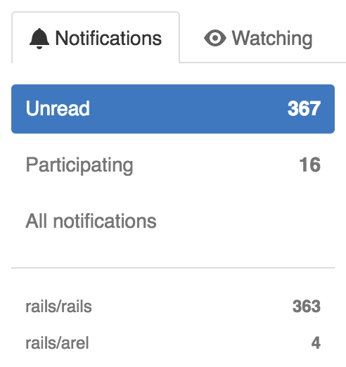

^ And this is just one day's worth. We try to get through all of this every day *and* attack the backlog, but it's hard sometimes. I can't speak for every project out there, but for Rails -- As long as the PR is assigned to someone, it is on our radar. It just takes time.

---

# There's a lot of reasons that something hasn't been merged yet

^ Keep in mind that there's often a list of priorities that maintainers have, and we don't always have time to get through it all. If something has been open for a while, there's a lot of reasons that could be the case. There was a great response on the Turbolinks repo recently

---

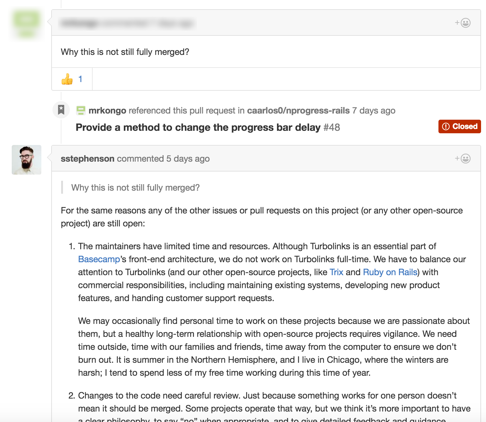

^ A person was asking why a pull request hasn't been merged, and one of the maintainers gave a great explanation of many of the reasons something can remain open. It basically boiled down to: We have limited time. Merging something requires code review which takes time (and we have limited time). This is a public API change so it needs docs and tests and more thorough review. We have other priorities right now (including a list of what they're focusing on) (and also we have limited time). Finally it wasn't a critical bug (and we have limited time).

---

# I wish we could merge everything, but we can't

^ There's always going to be limits, and we're not always going to be able to make everyone happy. We're not trying to be jerks. We're just trying to work in a way that's sustainable.

---

# I wish I could make everybody happy.

---

# Don't be a jerk

^ Please just remember to be nice. I'm not sure a lot of people believe the kind of shit we actually see, so let's take a look at my favorite example of failing at this.

---

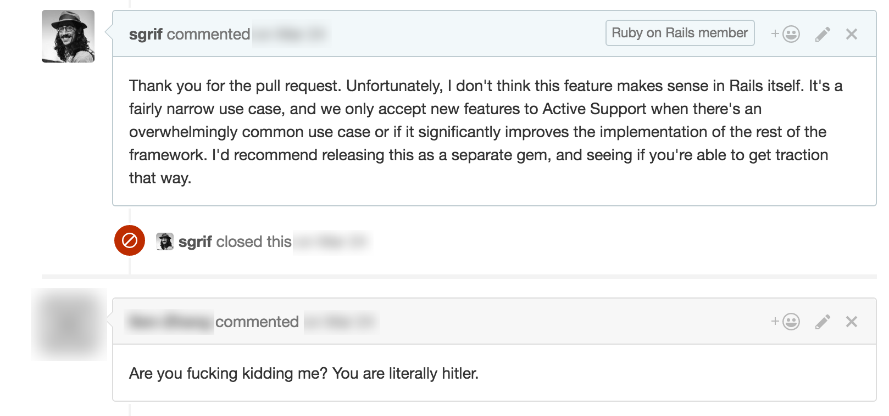

---

# wat

---


---


^ Really though this was a gift. One because I'm Jewish so I find it especially hilarious, but also because now when I'm having a bad day, I just remind myself "At least I didn't get called literally hitler on the internet today."

---

# Open source is maintained by humans

^ If you remember one thing from this talk, make it this. Open source maintainers are sometimes put on a pedestal. Or we're characterized as cartoon villains. But we're just people. We're fallible and have squishy things like feelings. Understanding this is the key to getting involved.

---

# The key to all of this is empathy
pick 1ade2f2 Release v0.7.2

^ It requires empathy. The biggest theme you can take away from this is that the key to submitting a good pull request is to simply consider the point of view of the human on the other side.

---

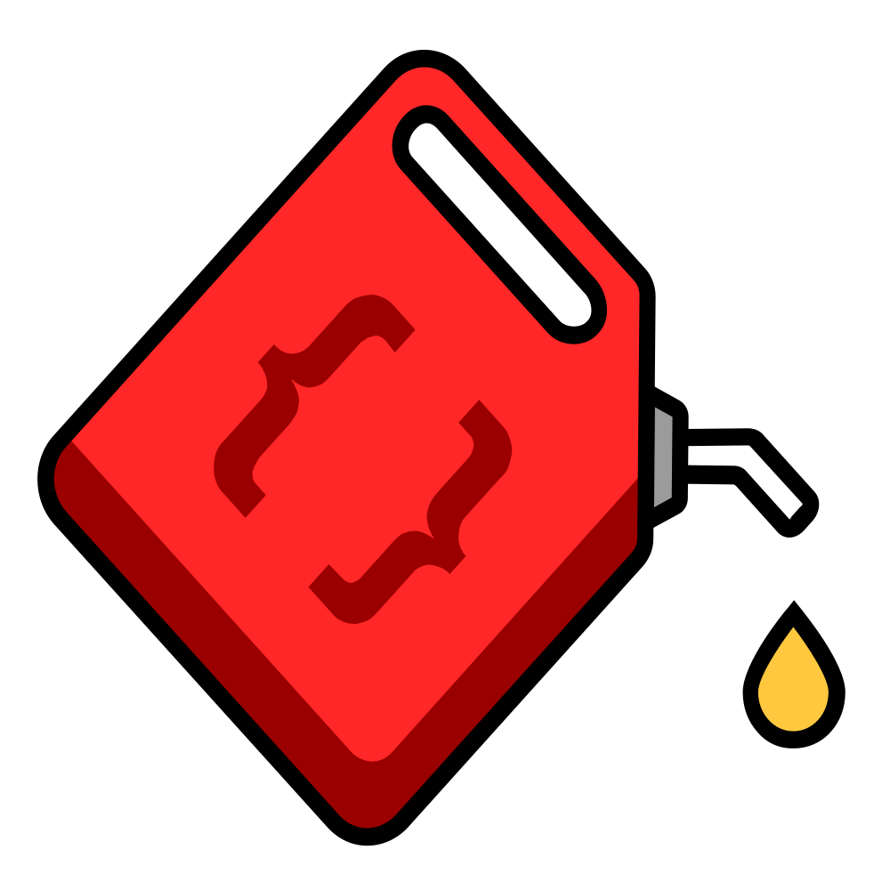

---


# http://diesel.rs

---


^ A big thank you to Shopify for paying for me to be here. If the upcoming election has you thinking that maybe you'd like to move to Canada, Shopify is hiring and we should chat.

---

# Questions?

---

# Thank you!

- Email: sean@seantheprogrammer.com
- Twitter: @sgrif
- Github: @sgrif
- http://diesel.rs
- http://bikeshed.fm
