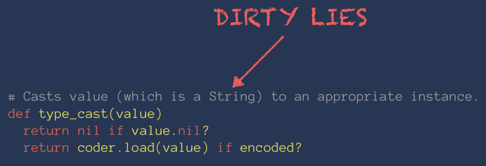

# Designing a Great Ruby API

---

- Sean Griffin
- Software Developer at thoughtbot
- Rails committer
- Bikeshed co-host


^ **Brief** intro about yourself

^ Today we're going to talk about API design. I'd like to take a look at a new API that is being introduced in Rails 5 as an example. It's called the Attributes API, and it allows you to hook into the type casting system in Active Record. We're going to talk about the process that went into developing it.

---

# What goes into a great API

1. Identify what is missing
2. Have a rough idea of what you want the API to look like
3. Test test test
4. Create the objects which will make up your system
5. Dogfood your system internally
6. Manually compose those together as needed
7. Extract DSLs where there is duplication or pain

---

# Identifying Holes in Your API

^ Before you can design a great API, you need to find the API that you're missing. In any large or legacy code base (and make no mistake, Rails is just a large legacy code base), you can find plenty of concepts that exist in your domain, but don't have an explicit name. Common signs of this can include structurally similar or duplicated code, methods with the same prefix, or multiple classes/modules frequently overriding the same method.

^ One of these concepts that became apparent inside of Active Record was changing the type of an attribute. If you wanted to do this inside of your code -- for example, to use a money object for price -- it might look something like this.

---

# Overriding an Attribute

```ruby
class Product < ActiveRecord::Base
  def price
    unless super.nil?
      Money.new(super)
    end
  end

  def price=(price)
    if price.is_a?(Money)
      super(price.amount)
    else
      super
    end
  end
end
```

^ With code like this, it's reasonable to wonder: "am I going to break any Rails magic here?". The answer is: "it depends", but here's a list of things that might work unexpectedly.

---

# Things you might break

- `_before_type_cast`
- Dirty checking
- Form builder integration

^ In addition, there's other things that you might want to do that are significantly harder right now.

---

# Things you might want

- Control over SQL representation
- Ability to query with your values

      ```ruby
      Product.where(price: Money.new(50))
      ```

^ Rails overrides attribute types in plenty of places. You might be wondering how we do it in Rails. If you guessed "with a pile of hacks", you'd be right!

---

# Warning!
# Rails Internals Ahead
## Not for the faint of heart!

---

# Time Zone Conversion

```ruby
# lib/active_record/attribute_methods/time_zone_conversion.rb

if create_time_zone_conversion_attribute?(attr_name, columns_hash[attr_name])
  method_body, line = <<-EOV, __LINE__ + 1
    def #{attr_name}=(time)
      time_with_zone = convert_value_to_time_zone("#{attr_name}", time)
      previous_time = attribute_changed?("#{attr_name}") ? changed_attributes["#{attr_name}"] : read_attribute(:#{attr_name})
      write_attribute(:#{attr_name}, time)
      #{attr_name}_will_change! if previous_time != time_with_zone
      @attributes_cache["#{attr_name}"] = time_with_zone
    end
  EOV
  generated_attribute_methods.module_eval(method_body, __FILE__, line)
end
```

^ Don't worry too much about the specifics of the code. This code will override the attribute writer for an attribute, so that times are converted to the current time zone. The implementation jumps through some hoops to maintain the "before type cast" version of the attribute, and has to redefine dirty tracking in this method as well.

---

# Time Zone Conversion

- Overriding an attribute reader/writer
- Duplicates code from other parts of Active Record
- Jumps through significant hoops for a relatively minor behavior change

---

# Time Zone Conversion

- Overriding an attribute reader/writer :white_check_mark:
- Duplicates code from other parts of Active Record :white_check_mark:
- Jumps through significant hoops for a relatively minor behavior change :white_check_mark:

---

# Time Zone Conversion

- Overriding an attribute reader/writer :white_check_mark:
- Duplicates code from other parts of Active Record :white_check_mark:
- Jumps through significant hoops for a relatively minor behavior change :white_check_mark:
- Introduces large number of subtle bugs :bomb:

^ Another thing to note about this style of code is that it introduces a large amount of subtle bugs, which are hard to detect since the concept is scattered over so many places.

---

# Serialized Attributes

```ruby
# lib/active_record/attribute_methods/serialization.rb

def typecasted_attribute_value(name)
  if self.class.serialized_attributes.include?(name)
    @attributes[name].serialized_value
  else
    super
  end
end
```

^ Here's another example, from the code for the `serialize` macro. In this case, we're just overriding the method that ultimately gets called to perform typecasting, rather than the reader/writer explicitly. Unfortunately it's not nearly this simple. Here's a look at some more of the code from that file

---

```ruby
module ClassMethods # :nodoc:
  def initialize_attributes(attributes, options = {})
    serialized = (options.delete(:serialized) { true }) ? :serialized : :unserialized
    super(attributes, options)

    serialized_attributes.each do |key, coder|
      if attributes.key?(key)
        attributes[key] = Attribute.new(coder, attributes[key], serialized)
      end
    end

    attributes
  end
end

def should_record_timestamps?
  super || (self.record_timestamps && (attributes.keys & self.class.serialized_attributes.keys).present?)
end

def keys_for_partial_write
  super | (attributes.keys & self.class.serialized_attributes.keys)
end
```

^ But wait, there's more!

---

```ruby
def type_cast_attribute_for_write(column, value)
  if column && coder = self.class.serialized_attributes[column.name]
    Attribute.new(coder, value, :unserialized)
  else
    super
  end
end

def raw_type_cast_attribute_for_write(column, value)
  if column && coder = self.class.serialized_attributes[column.name]
    Attribute.new(coder, value, :serialized)
  else
    super
  end
end

def _field_changed?(attr, old, value)
  if self.class.serialized_attributes.include?(attr)
    old != value
  else
    super
  end
end
```

^ And more

---

```ruby
def read_attribute_before_type_cast(attr_name)
  if self.class.serialized_attributes.include?(attr_name)
    super.unserialized_value
  else
    super
  end
end

def attributes_before_type_cast
  super.dup.tap do |attributes|
    self.class.serialized_attributes.each_key do |key|
      if attributes.key?(key)
        attributes[key] = attributes[key].unserialized_value
      end
    end
  end
end

def attributes_for_coder
  attribute_names.each_with_object({}) do |name, attrs|
    attrs[name] = if self.class.serialized_attributes.include?(name)
                    @attributes[name].serialized_value
                  else
                    read_attribute(name)
                  end
  end
end
```

^ And I think you get the picture. I left out several more pages for brevity. This one overrides almost every method in Active Record that contains the word "attribute"

---

# Serialized Attributes

- Overriding an attribute reader/writer
- Duplicates code from other parts of Active Record
- Jumps through significant hoops for a relatively minor behavior change
- Overrides literally everything
- Introduces large number of subtle bugs

---

# Serialized Attributes

- Overriding an attribute reader/writer :x:
- Duplicates code from other parts of Active Record :white_check_mark:
- Jumps through significant hoops for a relatively minor behavior change :white_check_mark:
- Overrides literally everything :white_check_mark:
- Introduces large number of subtle bugs :bomb: :bomb: :bomb: :bomb:

^ In this case we don't ever explicitly override the reader and writer, just the generic read/write attribute methods in Active Record. We see less direct copy/pasting of code, but this file ends up knowing about the entire structure of attribute assignment. And oh my god this thing caused so many bugs.

^ A couple of things I didn't show is that this macro ends up modifying the columns hash, which is something that we'll talk about a lot later.

---

# Enum

```ruby
# def status=(value) self[:status] = statuses[value] end
klass.send(:detect_enum_conflict!, name, "#{name}=")
define_method("#{name}=") { |value|
  if enum_values.has_key?(value) || value.blank?
    self[name] = enum_values[value]
  elsif enum_values.has_value?(value)
    # Assigning a value directly is not a end-user feature, hence it's not documented.
    # This is used internally to make building objects from the generated scopes work
    # as expected, i.e. +Conversation.archived.build.archived?+ should be true.
    self[name] = value
  else
    raise ArgumentError, "'#{value}' is not a valid #{name}"
  end
}

# def status() statuses.key self[:status] end
klass.send(:detect_enum_conflict!, name, name)
define_method(name) { enum_values.key self[name] }

# def status_before_type_cast() statuses.key self[:status] end
klass.send(:detect_enum_conflict!, name, "#{name}_before_type_cast")
define_method("#{name}_before_type_cast") { enum_values.key self[name] }
```

^ Same deal. Overriding various methods which exist at different points in the lifecycle.

---

# Enum

- Overriding an attribute reader/writer :white_check_mark:
- Duplicates code from other parts of Active Record :white_check_mark: :white_check_mark: :white_check_mark:
- Jumps through significant hoops for a relatively minor behavior change :white_check_mark:
- Introduces large number of subtle bugs :bomb: :bomb: :bomb: :bomb:

---

# We've Found a Missing Concept

Typed attributes are found and overridden *all over the place*. If we want to do this so much, maybe others do as well.

---

# Type Casting

^ Type casting is the process of explicitly converting a value from one type to another. Here's an example.

---

# Type Casting

```ruby
x = "1"
x.class # => String

x.to_i # => 1
x.to_i.class # => Fixnum
```

^ Details about code example

^ In Active Record, we do something called type coercion. Type coercion is the same process, but done automatically instead of explicitly.

---

# Type Coercion

```ruby
user = User.new
user.age = "30" # => "30"

user.age # => 30
user.age.class # => Fixnum
```

^ Details about code example

^ You might be wondering why we coerce values in the first place. Active Record was designed to work easily with web forms. Form input will always be a string, and having to cast manually would be cumbersome. This is especially true for more complicated types like dates. The type system has grown more complex than just handling strings, but the path it's taken can be traced back to that original constraint.

^ In Rails 4 and earlier, the only way to have a coerced attribute is if it's backed by a database column. We wanted to be able to hook into this behavior, and be able to modify it and use it independently of the database. This is what it looks like in the most simple case.

---

```ruby
class Product < ActiveRecord::Base
  attribute :name, String
  attribute :price, Integer
end
```

^ At this point we can come up with a rough idea of what the API will look like. At this point we know two things for sure. We'll need to specify the name of the attribute, and we'll need to specify the type. We should try to avoid over-specifying what it'll look like at this point.

^ Maybe rant about how the line between impl and usage is blurry at this point?

---

> Always design a thing by considering it in its next larger context -- a chair in a room, a room in a house, a house in an environment, an environment in a city plan

-- Eliel Saarinen

^ At this point all we know is that we're going to be introducing a type object into the system, but presumably that will not be enough for a reasonable implementation. We'll start on this process by composing the objects in our system manually, but we'll be looking for places to extract collaborators, and make composing them easier as we go through. Before we start introducing the API, we need to say a few brief words about refactoring.

---

# Rule #1 of Refactoring
## Have good test coverage

---

# Rule #2 of Refactoring
## HAVE GOOD TEST COVERAGE

---

# Rule #3 of Refactoring
## See rules 1 and 2

---

# Where we start

```ruby
# lib/active_record/connection_adapters/column.rb

# Casts value (which is a String) to an appropriate instance.
def type_cast(value)
  return nil if value.nil?
  return coder.load(value) if encoded?

  klass = self.class

  case type
  when :string, :text        then value
  when :integer              then klass.value_to_integer(value)
  when :float                then value.to_f
  when :decimal              then klass.value_to_decimal(value)
  when :datetime, :timestamp then klass.string_to_time(value)
  when :time                 then klass.string_to_dummy_time(value)
  when :date                 then klass.value_to_date(value)
  when :binary               then klass.binary_to_string(value)
  when :boolean              then klass.value_to_boolean(value)
  else value
  end
end
```

^ If you look for where type casting occurs in Rails 4.1, you'll find this. Like many things in Rails, it's a giant case statement. Awesome...

---



---

### `product.name = NotAString.new`

### `product.created_at = Time.now`

### `product.price *= 2`

---

# ಠ\_ಠ

---

```patch
diff --git a/activerecord/lib/active_record/connection_adapters/column.rb b/activerecord/lib/active_record/connection_adapters/column.rb
index 38efebe..3bab325 100644
--- a/activerecord/lib/active_record/connection_adapters/column.rb
+++ b/activerecord/lib/active_record/connection_adapters/column.rb
@@ -22,12 +22,14 @@ module ActiveRecord
       #
       # +name+ is the column's name, such as <tt>supplier_id</tt> in <tt>supplier_id int(11)</tt>.
       # +default+ is the type-casted default value, such as +new+ in <tt>sales_stage varchar(20) default 'new'</tt>.
+      # +cast_type+ is the object used for type casting and type information.
       # +sql_type+ is used to extract the column's length, if necessary. For example +60+ in
       # <tt>company_name varchar(60)</tt>.
       # It will be mapped to one of the standard Rails SQL types in the <tt>type</tt> attribute.
       # +null+ determines if this column allows +NULL+ values.
-      def initialize(name, default, sql_type = nil, null = true)
+      def initialize(name, default, cast_type, sql_type = nil, null = true)
         @name             = name
+        @cast_type        = cast_type
         @sql_type         = sql_type
         @null             = null
         @limit            = extract_limit(sql_type)
```

^ At this point, all we know about our eventual API is that we're going to have a type object. Currently type casting lives on the column, so that seems like a reasonable place to put the type object. Eventually we'll want to delegate behavior to it, but to start, the first change is just injecting it, and passing `nil` in. And then we run the tests. This will allow us to familiarize ourselves with where the responsibility of building these objects lives, which will also point us towards where we're going to ultimately end up constructing the type objects.

---

```patch
diff --git a/activerecord/lib/active_record/connection_adapters/column.rb
b/activerecord/lib/active_record/connection_adapters/column.rb
index 3bab325..0087c20 100644
--- a/activerecord/lib/active_record/connection_adapters/column.rb
+++ b/activerecord/lib/active_record/connection_adapters/column.rb
@@ -13,11 +13,13 @@ module ActiveRecord
+      delegate :type, to: :cast_type
+
       # Instantiates a new column in the table.
       #
       # +name+ is the column's name, such as <tt>supplier_id</tt> in
<tt>supplier_id int(11)</tt>.
@@ -35,7 +37,6 @@ module ActiveRecord
         @limit            = extract_limit(sql_type)
         @precision        = extract_precision(sql_type)
         @scale            = extract_scale(sql_type)
-        @type             = simplified_type(sql_type)
         @default          = extract_default(default)
         @default_function = nil
         @primary          = nil
@@ -263,40 +266,6 @@ module ActiveRecord
-
-        def simplified_type(field_type)
-          case field_type
-          when /int/i
-            :integer
-          when /float|double/i
-            :float
-          when /decimal|numeric|number/i
-            extract_scale(field_type) == 0 ? :integer : :decimal
-          when /datetime/i
-            :datetime
-          when /timestamp/i
-            :timestamp
-          when /time/i
-            :time
-          when /date/i
-            :date
-          when /clob/i, /text/i
-            :text
-          when /blob/i, /binary/i
-            :binary
-          when /char/i
-            :string
-          when /boolean/i
-            :boolean
-          end
-        end
     end
   end
```

^ Now one by one, we go about replacing each of the giant case statements with delegation to the type objects. This commit also introduced an object responsible for doing the lookup based on SQL type.

---

```patch
diff --git a/activerecord/lib/active_record/connection_adapters/column.rb
b/activerecord/lib/active_record/connection_adapters/column.rb
index 11b2e72..f46f9af 100644
--- a/activerecord/lib/active_record/connection_adapters/column.rb
+++ b/activerecord/lib/active_record/connection_adapters/column.rb
@@ -94,28 +94,10 @@ module ActiveRecord

       # Casts value to an appropriate instance.
       def type_cast(value)
-        return nil if value.nil?
-        return coder.load(value) if encoded?
-
-        klass = self.class
-
-        case type
-        when :string, :text
-          case value
-          when TrueClass; "1"
-          when FalseClass; "0"
-          else
-            value.to_s
-          end
-        when :integer              then klass.value_to_integer(value)
-        when :float                then value.to_f
-        when :decimal              then klass.value_to_decimal(value)
-        when :datetime             then klass.string_to_time(value)
-        when :time                 then klass.string_to_dummy_time(value)
-        when :date                 then klass.value_to_date(value)
-        when :binary               then klass.binary_to_string(value)
-        when :boolean              then klass.value_to_boolean(value)
-        else value
+        if encoded?
+          coder.load(value)
+        else
+          cast_type.type_cast(value)
         end
       end
```

---

```patch
diff --git a/activerecord/lib/active_record/connection_adapters/column.rb b/activerecord/lib/active_record/connection_adapters/column.rb
index f46f9af..0f0aa91 100644
--- a/activerecord/lib/active_record/connection_adapters/column.rb
+++ b/activerecord/lib/active_record/connection_adapters/column.rb
@@ -18,7 +18,7 @@ module ActiveRecord

       alias :encoded? :coder

-      delegate :type, to: :cast_type
+      delegate :type, :text?, :number?, :binary?, to: :cast_type

       # Instantiates a new column in the table.
       #
@@ -43,16 +43,6 @@ module ActiveRecord
         @coder            = nil
       end

-      # Returns +true+ if the column is either of type string or text.
-      def text?
-        type == :string || type == :text
-      end
-
-      # Returns +true+ if the column is either of type integer, float or decimal.
-      def number?
-        type == :integer || type == :float || type == :decimal
-      end
-
       def has_default?
         !default.nil?
       end
@@ -70,10 +60,6 @@ module ActiveRecord
         end
       end

-      def binary?
-        type == :binary
-      end
-
       # Casts a Ruby value to something appropriate for writing to the database.
       # Numeric columns will typecast boolean and string to appropriate numeric
       # values.
```

---

```patch
diff --git a/activerecord/lib/active_record/connection_adapters/column.rb b/activerecord/lib/active_record/connection_adapters/column.rb
index 107b18f..a23d2bd 100644
--- a/activerecord/lib/active_record/connection_adapters/column.rb
+++ b/activerecord/lib/active_record/connection_adapters/column.rb
@@ -18,7 +18,7 @@ module ActiveRecord

       alias :encoded? :coder

-      delegate :type, :text?, :number?, :binary?, :type_cast_for_write, to: :cast_type
+      delegate :type, :klass, :text?, :number?, :binary?, :type_cast_for_write, to: :cast_type

       # Instantiates a new column in the table.
       #
@@ -47,19 +47,6 @@ module ActiveRecord
         !default.nil?
       end

-      # Returns the Ruby class that corresponds to the abstract data type.
-      def klass
-        case type
-        when :integer                     then Fixnum
-        when :float                       then Float
-        when :decimal                     then BigDecimal
-        when :datetime, :time             then Time
-        when :date                        then Date
-        when :text, :string, :binary      then String
-        when :boolean                     then Object
-        end
-      end
-
       # Casts value to an appropriate instance.
       def type_cast(value)
         if encoded?
```

---

```ruby
module ActiveRecord
  module Type
    class String < Value # :nodoc:
      def type
        :string
      end

      def type_cast(value)
        if value
          value.to_s
        end
      end

      def serialize(value)
        case value
        when ::Numeric, ActiveSupport::Duration then value.to_s
        when true then "t"
        when false then "f"
        else super
        end
      end
    end
  end
end
```

^ So now we've refactored our existing type system into a structure that is easier to override. Now we need to look to introduce an API that allows us to override it. The simplest case we could start with would be changing the type of an attribute from string to integer. Let's write a test.

---

```ruby
class OverloadedType < ActiveRecord::Base
  create_table :overloaded_types do |t|
    t.float :overloaded_float
    t.float :unoverloaded_float
  end

  attribute :overloaded_float, Type::Integer.new
end

test "overloading types" do
  data = OverloadedType.new

  data.overloaded_float = "1.1"
  data.unoverloaded_float = "1.1"

  assert_equal 1, data.overloaded_float
  assert_equal 1.1, data.unoverloaded_float
end
```

^ This is what our first test might look like. What's important is that we've written the first invocation of our API. Let's talk about it more closely for a moment.

---

```ruby


attribute :overloaded_float, Type::Integer.new
```

^ We start simple, composing our objects manually. Keeping it this way will give us the most flexibility as we continue to explore this API. This ends up becoming one of our first decisions about what our final API will look like. We pass in an object, instead of some other placeholder. It might be less pretty than a symbol or constant, but it's simple. And I'm not just talking about from an implementation point of view. Understanding this line is much easier when you can see what the objects are. If you need details of its behavior, you know where to look in the docs. We don't have to worry about semantics of allowing types that weren't created by Active Record. It's just Ruby, and Ruby just works.

---

# Every DSL has a cost

^ Cognitive overhead

^ Requires memorization

^ Understanding Ruby is not enough. Puts additional burden on the reader to know that specific DSL, and any options you pass to it

^ Thin line between helpful and too magic

---

# Implement in small steps

^ At this point we can come up with a serviceable implementation by modifying the columns hash. This already feels quite wrong, since we're not changing the schema, we're changing the structure of the model. Unfortunately in 4.x these two things are tightly intertwined. But it'll do for now. However, if we try to just modify it directly, we'll run into another problem.

---

```ruby
def columns
  @columns ||= connection.schema_cache.columns(table_name).map do |col|
    col = col.dup
    col.primary = (col.name == primary_key)
    col
  end
end

def columns_hash
  @columns_hash ||= Hash[columns.map { |c| [c.name, c] }]
end
```

^ Attempting to access or modify the columns will hit the schema cache and execute a query. It's very important that you be able to load an Active Record class definition without a database connection, so we need to make our implementation lazy.

---

# Separate lazy from strict

^ Ultimately the fact that we need to define the attributes lazily is a relatively minor detail, and it'd be great to make the strict version available as well to build upon. Here's roughly what the code looks like at this point.

---

```ruby
def attribute(name, cast_type)
  name = name.to_s

  self.attributes_to_define_after_schema_loads =
    attributes_to_define_after_schema_loads.merge(
      name => cast_type
    )
end

def define_attribute(name, cast_type)
  clear_caches_calculated_from_columns

  @columns = columns.map do |column|
    if column.name == name
      column.with_type(cast_type)
    else
      column
    end
  end
end

def load_schema! # :nodoc:
  super
  attributes_to_define_after_schema_loads.each do |name, type|
    define_attribute(name, type)
  end
end
```

---

```patch
diff --git a/activerecord/lib/active_record/enum.rb b/activerecord/lib/active_record/enum.rb
index f053372..b70d52a 100644
--- a/activerecord/lib/active_record/enum.rb
+++ b/activerecord/lib/active_record/enum.rb
@@ -79,6 +79,37 @@ module ActiveRecord
       super
     end
 
+    class EnumType < Type::Value
+      # ...
+    end
+
     def enum(definitions)
       klass = self
       definitions.each do |name, values|
@@ -90,37 +121,19 @@ module ActiveRecord
         detect_enum_conflict!(name, name.to_s.pluralize, true)
         klass.singleton_class.send(:define_method, name.to_s.pluralize) { enum_values }
 
-        _enum_methods_module.module_eval do
-          # def status=(value) self[:status] = statuses[value] end
-          klass.send(:detect_enum_conflict!, name, "#{name}=")
-          define_method("#{name}=") { |value|
-            # writer implementation...
-          }
-
-          # def status() statuses.key self[:status] end
-          klass.send(:detect_enum_conflict!, name, name)
-          define_method(name) { enum_values.key self[name] }
+        detect_enum_conflict!(name, name)
+        detect_enum_conflict!(name, "#{name}=")
 
-          # def status_before_type_cast() statuses.key self[:status] end
-          klass.send(:detect_enum_conflict!, name, "#{name}_before_type_cast")
-          define_method("#{name}_before_type_cast") { enum_values.key self[name] }
+        attribute name, EnumType.new(name, enum_values)
@@ -138,25 +151,7 @@ module ActiveRecord
     private
       def _enum_methods_module
         @_enum_methods_module ||= begin
-          mod = Module.new do
-            private
-              def save_changed_attribute(attr_name, old)
-                # significant source of bugs
-              end
-          end
+          mod = Module.new
           include mod
           mod
         end
```

^ Unfortunately, most of our use cases need to modify the type of an attribute, without replacing it completely. What we need are decorators. However, just like replacing the type completely, this too needs to be lazy, since actually getting the type of an attribute will require hitting the database.

---

# Make your internal APIs as pleasant to use as your external APIs

---

```ruby
def decorate_matching_attribute_types(matcher, decorator_name, &block)
  self.attribute_type_decorations = attribute_type_decorations.merge(decorator_name => [matcher, block])
end

private

def load_schema!
  super
  attribute_types.each do |name, type|
    decorated_type = attribute_type_decorations.apply(name, type)
    define_attribute(name, decorated_type)
  end
end
```

^ There's a good bit of code I'm leaving out for brevity. `attribute_type_decorations` is actually an object which will apply multiple decorations in the order they were defined. One thing that's important to note is that even though we don't need to take a decorator name, we would prefer to be able to have an idempotent API.

---

```ruby


matcher = ->(name, type) { create_time_zone_conversion_attribute?(name, type) }
decorate_matching_attribute_types(matcher, :_time_zone_conversion) do |type|
  TimeZoneConverter.new(type)
end
```

^ Again, we'll leave out a good bit of the code here, but we're able to replace a good bit of code with a relatively simple type. We no longer need to add additional hacks to decorate the column object, instead we have a single canonical way to hook into decorating the types. We can do the same thing for serialization.

---

```ruby


matcher = ->(name, _) { name == attr_name }
decorate_matching_attribute_types(matcher, :"_serialize_#{attr_name}") do |type|
  Type::Serialized.new(type, coder)
end
```

^ Again, idempotence is important here. Multiple calls to serialize on an attribute should override the previous calls, not serialize multiple times. Always matching an attribute with a given name seems like a generic enough pattern that we can codify it.

---

```ruby


def decorate_attribute_type(attr_name, decorator_name, &block)
  matcher = ->(name, _) { name == attr_name.to_s }
  key = "_#{column_name}_#{decorator_name}"
  decorate_matching_attribute_types(matcher, key, &block)
end
```

---

```ruby
def serialize(attr_name, class_name_or_coder = Object)
  coder = if [:load, :dump].all? { |x| class_name_or_coder.respond_to?(x) }
            class_name_or_coder
          else
            Coders::YAMLColumn.new(class_name_or_coder)
          end

  decorate_attribute_type(attr_name, :serialize) do |type|
    Type::Serialized.new(type, coder)
  end
end
```

^ The ability to make changes like this is paramount to a great API. A good API is easy to use, but a great API can be very easily built upon. Here we took a simple idea, being able to say "make this attribute be of this type". We turned that into the ability to decorate an existing type, built on that common patterns for decoration, and then were able to succinctly describe what serialize does in terms of this API.

---

```ruby
module ActiveRecord
  module Type
    class Serialized < DelegateClass(Type::Value) # :nodoc:
      attr_reader :subtype, :coder

      def initialize(subtype, coder)
        @subtype = subtype
        @coder = coder
        super(subtype)
      end

      def deserialize(value)
        if default_value?(value)
          value
        else
          coder.load(super)
        end
      end

      def serialize(value)
        return if value.nil?
        unless default_value?(value)
          super coder.dump(value)
        end
      end

      private

      def default_value?(value)
        value == coder.load(nil)
      end
    end
  end
end
```

^ This is the type that described all of the casting behavior of serialize. I wanted to show the diff with the code that was removed, but I couldn't get it to be visible on a slide. We're talking about hundreds of lines.

---

# Make your API universal

## There should be one canonical way to access things

---

# Blurrrrrrrrrghhhhhh

## Slides...
