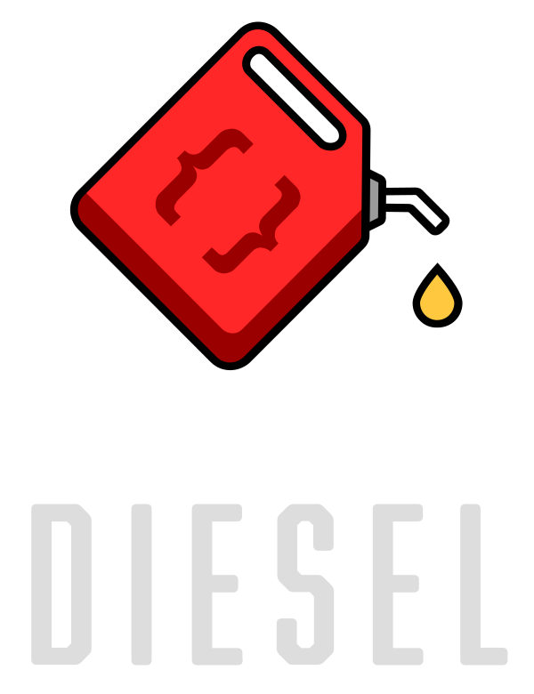
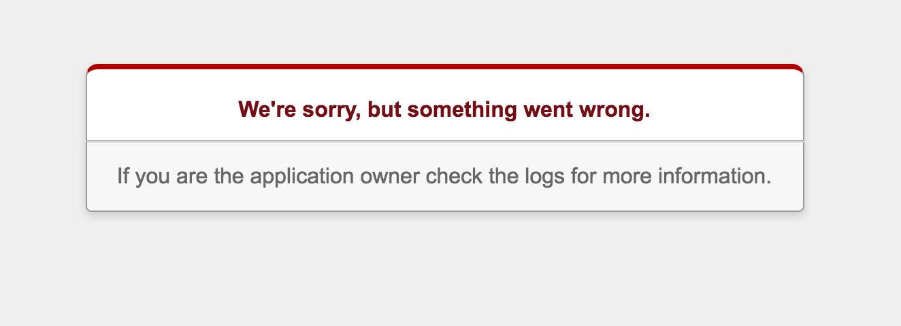
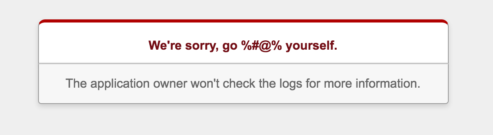

# Databases

## What we can learn from other languages

^ There is some debate as to whether it is pronounced dātabases or dătabases. I'm going to randomly switch between the two in order to troll as many of you as possible.

---

# Who am I?

- Sean Griffin
- Rails Committer
- Maintainer of Active Record
- Creator of Diesel
- Bikeshed co-host

^ My name is Sean Griffin, and I am the maintainer of Active Record. Today I want to talk to you about the direction I see the framework heading.

---

# What does Active Record do for us?

^ If we're going to compare Active Record to alternatives, we need to isolate the key features that we want to focus on. Since we have a limited amount of time, today we're going to look at two of them.

---

# Eases building simple queries

^ This is one of the more common features of ORMs, but there are still several that only allow you to write raw SQL directly.

---

```ruby


User.find_by(first_name: "Sean")
```

^ With Active Record, we can write code that looks like this. We want to find the user with the given first name. It pushes us more into thinking about our problem domain.

---

```ruby


result = connection.execute(
  "SELECT users.* FROM users WHERE first_name = $1",
  ["Sean"],
)
```

^ With out it, we'd have to write code like this. This code is much more focused on the semantics of query execution. It's concerned with how to handle bind parameters, and it's much harder to compose with other bits of code we'd like to reuse.

---

## Maps query results to objects

^ Now mapping relation data to objects is probably the one feature that you can assume all Object Relational Mapper libraries, have, but it still is worth mentioning.

---

```ruby


row = result.first
if row
  User.new(row.to_h)
end
```

^ Cases where you only have a single table or model are actually pretty simple without the mapping (at least with Active Model style constructors). However, things get much more complex if we're loading more than one type of object. Code with an association eager loaded from a join wouldn't fit on a slide

---

# Active Record's decisions have tradeoffs

^ Every one of those examples has tradeoffs in its API decisions. Originally this slide said "Active Record is flawed", but I don't think that conveys the right idea. Every decision has tradeoffs. It will encourage one type of code, while discouraging another. An API that might seem better for users might be more complex, making it more prone to bugs.

---

# Active Record must evolve

^ As Matz mentioned in his keynote, nothing stays popular forever. Rails needs to continue to evolve if it is to survive. One of the reasons it's survived this long is that we as a community are great about looking to other languages and frameworks for inspiration, and bringing the best ideas back.

---



^ Diesel is an ORM and Query Builder I've written in Rust. It has a focus on type safety, speed, and extensibility. One of my biggest goals with the library is to completely eliminate runtime errors that result from incorrect queries

^ We're going to take a look at some of the tradeoffs in its API design vs Active Record's.

---

# Building a Query (Rails)

```ruby


User.find_by(first_name: "Sean", last_name: "Griffin")
```

^ Let's go back to our earlier example, and examine it a little bit closer. What are the tradeoffs of this API?

---

# Pros

- Concise
- Small API surface
- Don't have to worry about the database connection

^ It's concise. You can express a lot of constraints, without a lot of mental overhead. `find_by` on its own is a pretty small. There's some complexity when you worry about passing arrays or ranges to it, but for the more straightforward cases, it's a small API. We also don't have to worry about the database connection at all here. It "just works".

---

# Cons

- Very implicit behavior
- Limited in capabilities
- Have no control over the database connection

^ The code could be considered magic, however. The code doesn't express that it's filtering by equality, and you just have to "know" what the hash means. When you take arrays and ranges into account, the behavior feels even more implicit. This API is also pretty limited. It can't handle much outside of equality. You couldn't do something like less than

^ As Matz mentioned in his keynote, shared state can cause significant problems for programmers. Ultimately the AR database connection is a form of shared global mutable state. This causes major issues if you're looking to perform things like database sharding.

---

# Building a Query (Diesel)

```rust


users.filter(first_name.eq("Sean").and(last_name.eq("Griffin")))
    .first(&connection)
```

^ This is what performing the same query would look like in Diesel. One major difference here is that Diesel queries are focused around the database schema, not the models. So we're referencing the users table, not a model called user. You can load the result into any structure of the right overall shape, and usually the compiler will infer the type that you wanted.

^ We also have concrete types to represent the columns. `first_name` and `last_name` represent the `first_name` and `last_name` columns. Each column gets a unique type to represent it, which lets us verify things like ensuring you don't reference columns from another table without joining to it.

^ Also just as a note, the method name `filter` isn't a preference. `where` is a keyword in Rust. If I could name that method where, I would.

---

# Pros

- Extremely explicit
- Extends beyond equality easily
- Have complete control over the database connection

^ This code is much more explicit. We're stating exactly the operation that we want to perform, and we're also specifying that we want to use `AND` instead of `OR` or something else. Because of this, it's also very easy to do operations other than equality. We have a much larger API at our disposal, since we're dealing with unique types and not a hash.

^ We're also explicitly passing the database connection here. This gives you a lot of control over exactly when the query gets executed, and lets you switch dātabases for things like sharding easily. Since methods that perform queries require a dătabase connection, it's easy to see those side effects based on whether a function takes a connection as an argument.

---

# Cons

- More verbose
- Lots of parenthesis
- Larger API surface
- Need to pass the database connection around

^ However, this code has a bit more weight to it. Being explicit usually means being more verbose, and there's a lot of parenthesis which add visual noise. While the query builder is more flexible, that also means that the API surface is a lot larger, which means more methods to remember. Even if the methods are well named, you have to remember the name and that they exist.

^ We also have to pass the database connection around. The goal is to encourage isolating where you perform queries to the outer layers of your application, like the controller. But that means that doing queries in multiple places is more painful, as you have to pass this around. I consider this a pro, but it's worth noting that it can be considered a con.

---

```ruby


Article.where("published_at > ?", 5.days.ago)
```

^ So let's start to look at where Active Record is a bit more limited. If you wanted to get the articles published in the last 5 days, Active Record will make you fall back to writing raw SQL. This isn't automatically a problem, but it has drawbacks in Active Record itself. This query won't actually use a bind param, it'll put the 5.days.ago in the query directly. This means that it can't use the prepared statement cache. Additionally, Active Record sometimes aliases columns, which we would then have to care about in our SQL.

---

```sql


SELECT * FROM "articles" WHERE published_at > 'Some timestamp here'
```

^ The result is this query, which is pretty much exactly what we wrote.

---

```rust


articles.filter(published_at.gt(now - 5.days()))
```

^ This is how we'd write the same query in Diesel. We use the `gt` method to use the greater than operator, and we ask for a date that is 5 days earlier than now.

---

```sql


SELECT "articles"."id", "articles"."title", "articles"."published_at"
    FROM "articles"
    WHERE "articles"."published_at" > CURRENT_TIMESTAMP - $1
```

^ And this is the query it generates. This isn't exactly the same as the Rails version. We're asking for "now minus 5 days", instead of giving it our definition of 5 days ago. PostgreSQL will freeze time inside of a transaction, and the time zone will be based on the database instead of where the code is being run. This isn't really better or worse, just different and worth noting.

^ You'll also notice that Diesel is explicit about all of the columns it wants. This is because internally it fetches rows by index rather than name, and gains a lot of performance by doing so.

^ But now let's look at a slightly different type of query that we can't express in Active Record. What if we wanted all the posts that were published today?

---

```ruby


Article.where("DATE(published_at) = CURRENT_DATE")
```

^ This is what I'd consider to be the most "correct" way to write this query. If we wanted to generalize it to any date, we could replace the right side with a bind parameter, and call `Date.today` in Ruby, but this works for just today.

---

```sql


SELECT *
    FROM "articles"
    WHERE DATE(published_at) = CURRENT_DATE
```

^ And this is the SQL it'd generate. Pretty much exactly what we gave it. However, Active Record users seem to generally have an aversion to SQL. So I don't think most Rails developers would write this.

---

```ruby


Article.where(published_at: Time.now.at_beginning_of_day..Time.now.at_end_of_day)
```

^ I think they might instead write something like this. We're passing it a range of timestamps representing the start and end of the day. This will cause Active Record to generate this SQL

---

```sql


SELECT *
    FROM "articles"
    WHERE published_at BETWEEN $1 AND $2
```

^ And the two bind parameters will be midnight and 11:59 PM.

---

```ruby


Article.where(published_at: Time.now.at_beginning_of_day..Time.now.at_end_of_day)
```

^ The code is much more muddled though. What we're trying to do is compare the date portion of a timestamp. But this code doesn't express that, it seems to care more about what a day is. And a lot of Rails devs really like the simple hash form, so I think many people would go even further and do this:

---

```ruby


class Article < ActiveRecord::Base
  def published_at=(new_value)
    self.published_on = new_value.to_date
    super
  end
end
```

^ Here we've gone ahead and added a whole new column called `published_on`, which we update whenever someone sets `published_at`. Or even worse, do this

---

```ruby


class Article < ActiveRecord::Base
  before_validate do
    if published_at_changed?
      self.published_on = published_at.to_date
    end
  end
end
```

^ Instead of overriding the setter, they might do the same thing in a callback instead. And all of this is in pursuit of being able to write this code in the rest of the code

---

```ruby


Article.where(published_on: Date.today)
```

^ Don't get me wrong, this is nice to be able to write. But in order to do this we've added a ton of extremely complex machinery, and swept that complexity under the rug. But these are the sort of decisions that Active Record subtly pushes us towards. By providing a concise API here, but not allowing more complex queries, we push people in pursuit of being able to express their ideas with just this form of `where`. And sometimes that might cause people to come up with a simpler answer, but more often I think we put ourselves through contortions to fake simplicity instead.

---

```sql


SELECT *
    FROM "articles"
    WHERE "articles"."published_on" = $1
```

^ It does generate awfully simple SQL, too.

---

```rust


articles.filter(date(published_at).eq(current_date))
```

^ Here's that query in Diesel. It's basically the same as the SQL form in Active Record, just using the rust DSL instead. The only difference is that this code wouldn't have to change at all to work with arbitrary dates, just the argument to `eq`. We'd be able to continue to use `CURRENT_DATE` or Rust dates interchangeably, without having to switch APIs.

---

```sql


SELECT "articles"."id", "articles"."title", "articles"."published_at"
    FROM "articles"
    WHERE DATE("articles"."published_at") = CURRENT_DATE
```

^ And for completeness, here's the SQL that would be generated.

^ But now let's look at something even more pathological. Assuming we went down that route where we created our `published_on` column, what if we had a form where you could put in any date? And what if the user typed in something that wasn't a date. We'd end up doing the equivalent of this:

---

```ruby


Article.where(published_on: "wibble")
```

^ Just to be clear, "wibble" is not a valid date. Not even in America, where we're weird and put the month first. So happens if we run this code?

---

```sql


SELECT *
    FROM "articles"
    WHERE "articles"."published_on" = $1
```

^ Well, Active Record will do exactly what you told it. It'll filter by equality, where published_on is equal to wibble. And we'll get back

---

### ActiveRecord::StatementInvalid: PG::InvalidDatetimeFormat: ERROR:  invalid input syntax for type date: "wibble"

^ A big fat runtime error, telling us that wibble isn't a valid date. Or as I tend to read errors

---

### ActiveRecord::ProgrammerInvalid:

### Sean you're terrible at this and should give up

^ Hopefully you don't have to encounter the ProgrammerInvalid error too much. My computer and I have a troubled relationship sometimes. I don't like runtime errors...

^ Anyway, more importantly is how your users will see this

---



^ Oops...

^ Also, this isn't what your users see. What they actually see is

---



^ As I was writing this, I actually got this wrong and thought we would do something else.

---

```sql


SELECT *
    FROM "articles"
    WHERE "articles"."published_on" IS NULL
```

^ This is what I expected to happen here, as it's what our type system normally does with invalid input.

---

## Three States of Active Record Attributes

- User Input

---

## Three States of Active Record Attributes

- User Input
- Ruby Values

---

## Three States of Active Record Attributes

- User Input
- Ruby Values
- Database Values

^ Usually we take "user input", but `where` is a special case that only takes Ruby values. This is unexpected, and will potentially change in the future. I recall writing this due to interactions with `serialize`, but that appears to no longer be true. It looks like this is just due to weird interactions with adequate record that I think I can work around. Now I'm just rambling about internals that I was poking this morning...

^ Regardless of whether it's `nil` or a runtime error, the problem is the same.

---

```rust


articles.filter(date(published_at).eq("wibble"))
```

^ So this is the Diesel equivalent again. Let's look at what happens when we try to run this code

---

### the trait `AsExpression<Date>` is not implemented for the type `str`

^ This just won't compile in Diesel. We don't allow queries that could result in runtime errors (within reason). We aren't doing anything magic with the string "wibble" here, we just don't allow you to send strings for date fields at all. You'll need to convert it into a date object somewhere else. This would have probably happened at the controller layer, which would let you abort and give a form/api error much earlier.

---

# What can we do in our Rails apps to improve this?

^ I think that we can all benefit from doing what we'd be forced to do if Rails took Diesel's approach here.

---

# Validate user input in the controller

^ If I could, I'd remove type coercion from Active Record entirely. I don't think an ORM is the right place to handle it. That's a concern that belongs at the controller layer, where you'd actually handle the error. As a result of where things live in Active Record, we end up having to do some really weird things like coercing invalid values to `nil` when you assign them. The idea there is that we don't want to raise an exception when you're assigning unchecked user input, and that you should use a validation if you actually care. But I think that leads to unexpected behavior more often than not, and would be more easily solved by just handling this in the controller.

^ And you can already do that today. You could write code like this:

---

```ruby


def show
  if date = parse_valid_date(params[:date])
    @articles = Articles.find(published_on: date)
  else
    render_form_with_errors
  end
end
```

^ We just try to parse the date, and if we can't we show an error to the user. You don't necessarily need to do this for all fields. For string fields, everything is valid. Numeric fields will treat invalid input as 0, which may or may not be what you want. But the important thing is that you have control, and get to decide for yourself if that's right in a given situation.

---

```ruby


def parse_valid_date(value)
  Date.parse(value)
rescue ArgumentError
  nil
end
```

^ And this is what that parsing function might look like. Since `Date.parse` doesn't give an error more general than ArgumentError, we need to put this in another method and handle it here.

---

# Abstracting over queries

^ Finally, let's take a look at how these libraries encourage you to abstract over queries. In Active Record, we call this a named scope.

---

```ruby


class Article < ActiveRecord::Base
  def self.recent
    where("published_at > ?", 10.days.ago)
  end
end

Article.recent
```

^ If we want to get recent articles, we can create a class method that adds that where clause, and just call it. We're abstracting over the whole query, and calling into that abstraction elsewhere.

---

```rust


fn recent() {
    published_at.eq(now - 10.days())
}

articles.filter(recent())
```

^ By contrast, Diesel abstracts over the predicate instead of the whole query. You create a function that represents what a recent article is, and then elsewhere you pass that to the where clause. So instead of abstracting over the entire query, we just abstract over the predicate. I think the results of these approaches can be best shown through one specific method.

---

## Let's talk about `Relation#or`

^ And that method is `Relation#or`. If you're unfamiliar, this is a new addition in Rails 5 that lets you add an or clause to your query. Yes, 6 years after we introduced Relation, we finally gave you a way to write or in your SQL. And this is what the API looks like:

---

```ruby


relation.or(other_relation)
```

^ You call this method on a relation, and it takes another relation as an argument. There were a lot of different APIs that were considered for this. One alternative that got proposed often was this:

---

```ruby


relation.or(foo: :bar)
```

^ Where it takes a hash, instead of another Relation, behaving the same as `where`. We didn't go this direction for a couple of reasons.

---

# `#or` has multiple valid meanings

^ Does this mean adding OR to the where clause? To the having clause? It might also be reasonable to think that this would create a union between two queries. One proposal to clarify this was to have the API look like `where.not`

---

```ruby


relation.where.or(foo: :bar)
```

^ But this doesn't really accomplish what we wanted, as it doesn't abstract or compose well.

---

# We wanted to optimize for named scopes

^ Ultimately what we considered the most important case was combining two named scopes, each of which could be used on their own. This means that the API is a bit more verbose if you want to do a one-off query, but is much better suited for code re-use

---

### `Article.recent.or(Article.popular)`

^ And this is what the intended usage looks like. But here's where it gets tricky. I showed `recent` earlier, as just being a `where` clause. But what if `popular` looked like this.

---

```ruby
class Article
  def recent
    where("published_at > ?", 10.days.ago)
  end

  def popular
    order(comments_count: :desc)
      .limit(10)
  end
end
```

^ It doesn't have any `where` clause, it's a call to `order` and `limit`.

^ All of the sudden, our query is nonsense. `order` and `limit` don't make sense with `or`. So what should we do? Ignoring it is almost certainly going to cause mistakes to slip through. We could call it undefined behavior, but I think using libraries which have a large surface area of undefined behavior are incredibly painful to use. So we have to check for this case, and raise an exception. And we can't just raise an exception when you call `order`, since it would break things with default scopes. We have to go through every part of the query and make sure that they're the same on both sides, and error if not.

---

# This complicates implementation

^ This improves the API, but adds a significant maintenance burden. A lot of users like to ignore this cost, but here's the thing...

---

# Framework code isn't special

^ Framework devs don't have super powers. We're normal developers just like everybody else. Our code is not perfect, and it can have bugs. Like everyone else, we have a limited amount of time to devote to fixing them, which means some bugs will stick around longer than we'd like. And just like app code, the more complex our code is, the more prone to bugs it's going to be.

^ I'm also of the opinion that APIs with a complex implementation tend to be harder to understand and use. They have more corner cases which work against intuition.

---

# This problem doesn't exist in Diesel

^ This is because as we saw earlier, Diesel doesn't encourage you to abstract over entire queries, it encourages you to abstract over smaller pieces, like a predicate. We combine these as needed at the point we actually want to perform the query. Predicates compose, queries do not.

---

# What if Rails worked the same way?

^ So what could an API in Rails look like for this? Here's a hypothetical look.

---

```ruby


class Article
  predicate :recent do
    published_at.gt(10.days.ago)
  end
end
```

^ Instead of a scope that returns a whole query, we could return predicates instead. This might just be a class method instead of a macro, though I'm not sure if I like the idea of defining class methods to represent each column. But like Diesel, those column objects would have a larger API.

---

```ruby


Article.where(Article.recent)
```

^ And then we can compose them elsewhere. That might get a little bit painful having to repeat `Article` so much, so perhaps we would have something like this

---

```ruby


Article.query do
  where(recent)
end
```

^ Since we can't really import those methods in Ruby without polluting some namespace, we could perhaps provide a method for you to do that. This is just a hypothetical look at a potential API, but this is the direction I imagine.

---

# `Relation#or` would not need to exist

^ And like in Diesel, our type that represents a query can focus soley on that. Methods like `#or` live on the predicate level, where they make much more sense.

---

```ruby


Article.query do
  where(recent.or(popular))
end
```

^ We can just compose our predicates this way. And popular in this case is definitely a predicate, this code would make no sense otherwise

---

# A query shouldn't be a unit of composition

^ Yes, we have `Relation#merge`. But its semantics are poorly defined and often hard to grasp. Not everything has a straightforward way to combine them. What if they both have a group by clause? Applying one and then the other can potentially change the semantics of things like select to no longer be valid when combined.

^ This is also why I've opted not to address several of the holes in its API. `or` was too important to leave behind, but things like "less than" are still not easily possible. I've gotten a lot of pull requests that add something like this

---

```ruby


Article.where.gt(published_at: 5.days.ago)
```

^ Half of the pull requests proposing this *only* add less than or greater than, but not both for some reason... But this API is poor. You rarely want to use one of these operators on more than one column at a time. If you happen to need that, your mental model for how you group them likely isn't based on what logical operator you're using. So there's no reason for this to take a hash.

^ This also doesn't compose well. Once again, we're having a `Relation` stand in as the unit of composition, when all we really want to do is combine a single predicate.

---

# We need to start moving away from `Relation`

^ And I'm working towards making that happen. Don't worry, it'll continue to exist, but it'll get moved to a gem. I don't want to deprecate it, but I also don't want to maintain it, so that means that I need to extract it in a way that it can be built purely on public API from the rest of Active Record. And this will be good for the ecosystem, because it means we can experiment with a lot of ideas for query builders at that point.

---

# Method chaining shouldn't be how we compose our abstractions

^ This isn't to say I don't want an API with method chaining. I think that calling `where`, `order`, and other query methods in a fluent API makes a lot of sense. But using it to apply and combine named scopes is where I see the problem

---

# You could fake this with Arel (but you probably shouldn't)

^ It's worth noting that `where` happens to allow passing an Arel node. Arel is not part of Active Record's public API, and this is not guaranteed to work in the future. But it's worth mentioning that you could accomplish something similar to what I'd like us to eventually have by returning Arel predicates from your class methods.

---


# http://diesel.rs

^ If you're interested in learning more about Diesel, you can check it out on the web.

---


# I have stickers!

^ I've brought Diesel stickers if you're interested. Feel free to find me afterwards and ask for one. Keep in mind that they go on like this, not with the can upright. I also host a podcast called The Bikeshed, where I talk about topics like this every week. If you're interested, the URL is bikeshed.fm. Thank you to Shopify for paying for me to be out here.

---

# Questions?

---

## Contact

- twitter: @sgrif
- github: @sgrif
- email: sean@seantheprogrammer.com

## Links

- diesel.rs
- bikeshed.fm
