# Keeping Rails Relevant

---

# Who am I?

- Sean Griffin
- 10x Hacker Ninja Guru at Shopify
- Rails Committer
- Maintainer of Active Record
- Creator of Diesel
- Bikeshed co-host

---

## @sgrif on Twitter

#### (I will judge my self worth on how many tweets I get)

---

# I am very mad at Steve

---

# How do we keep Rails relevant?

---

## This is the last talk I will be giving for a while

^ And y'all built one of my favorite things on the planet, which has done a really good job at remaining relevant.

---

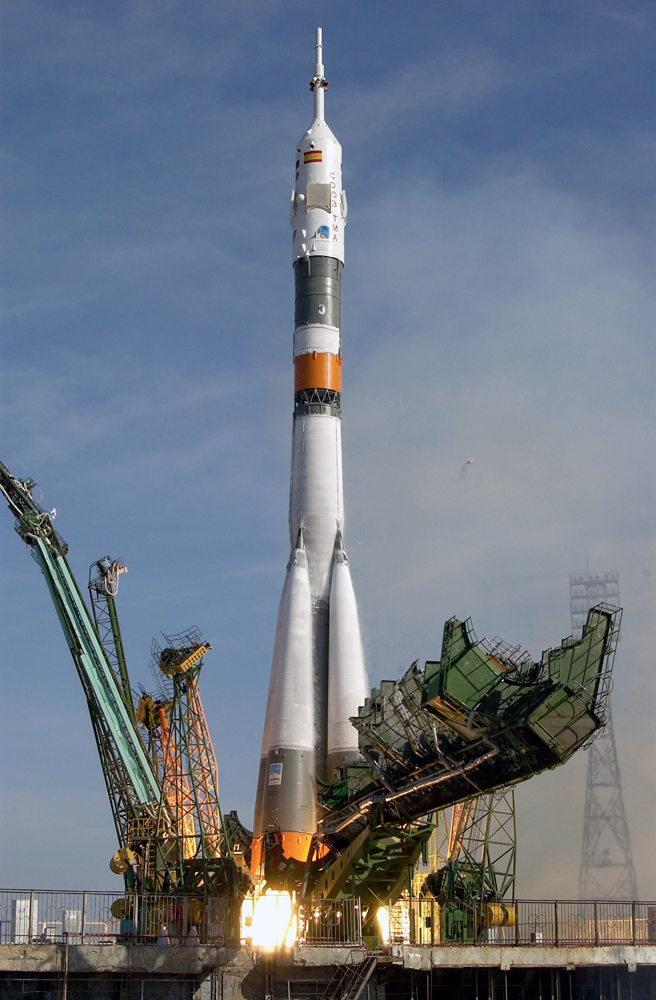

^ This is the Soyuz spacecraft. Its most used variant has flown 784 times, and has seen 43 years of active service. It's part of the R7 family of rockets, which has seen over 1700 launches. It was the family that launched Sputnik, and it's still the workhorse of spaceflight today. So if there's anywhere we can learn about how to keep something relevant, it's from this amazing piece of Russian engineering.

---

# Spaceships are really cool

^ And I'm really into space. So if this is my last talk, we're gonna talk about spaceships.

---

# Welcome to Spaceship Conf 2016

^ So welcome. I'm super excited to be here at Spaceship Conf 2016. Before we can see how the R7 relates to our world in software, let's take a brief look at how spaceflight started.

---

# Konstantin Tsiolkovsky

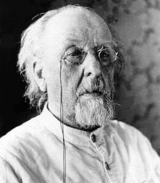

^ The history of modern spaceflight begins with a Russian scientist named Tsiolkovsky (phonetic: Sil-kov-ski). In 1896 he created what is now known as the Tsiolkovsky rocket equation, which was published in 1897. This is the formula.

---

# Tsiolkovsky Rocket Equation

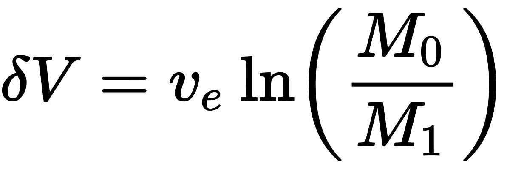

^ As all early morning talks should, we start with some math. Now if you're like me, this sort of notation is completely meaningless to you. So we'll look at some code from a little program I wrote.

---

# Tsiolkovsky Rocket Equation

```rust
fn delta_v(rocket: &Rocket) -> f64 {
    rocket.engine.isp()
        * (rocket.wet_mass() / rocket.dry_mass()).ln()
        * GRAVITY
}
```

^ However, I wrote that program in Rust. And since **Steve** is here, we're not going to talk about Rust. So let's look at it in Ruby.

---

# Tsiolkovsky Rocket Equation

```ruby
def delta_v(rocket)
  rocket.engine.specific_impulse
    * Math.log(rocket.wet_mass / rocket.dry_mass)
    * GRAVITY
end
```

^ This formula is used to determine the most important number when it comes to rockets. Delta-V or change in velocity. In space, there is no air to slow you down. All changes to your speed are done by the rocket's engines. What this basically means is that the total amount you can change your velocity by determines how far a rocket can go.

^ The way we calculate this number is by starting with the specific impulse of the engine. Specific impulse determines how much thrust an engine produces per unit of fuel. Wet mass is the mass of a rocket when fully fueled, and dry mass is the mass of the rocket after all the fuel has been burned. So the mass of the engine, the tanks, and any payload it is carrying. The rocket equation multiplies the specific impulse of the engine by the natural logarithm of the ratio between the two masses.

^ The original rocket formula assumes that isp is measured as a unit of velocity.  However, today we commonly represent it as a unit of time so we have to multiply by the gravitational constant, or 9.8066 meters per second squared.

---


^ Ok, maybe that was too much math for this early in the morning. But from that formula, in 1903 Tsiolkovsky was able to determine that in order to orbit the Earth you would need to have a horizontal velocity of 8000m/s, and that this could be achieved by a multistage rocket fueled by liquid oxygen and liquid hydrogen. We also used that same math to determine how much delta-v is required to get anywhere in the solar system.

---

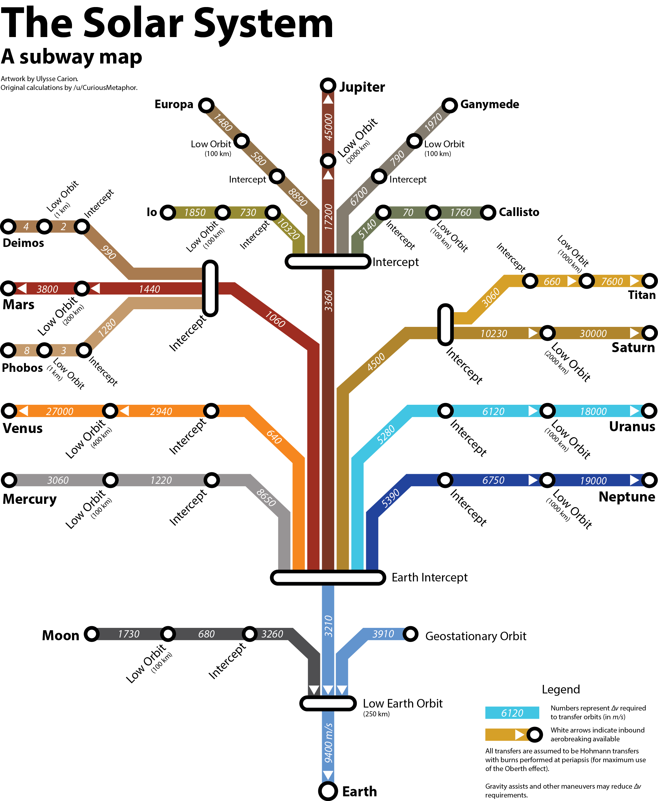

^ Those numbers are really small, but for example from low earth orbit we know that it takes an additional 3300 meters per second to reach the moon, and an additional 660 meters per second to orbit the moon after that. To get from low earth orbit to geostationary orbit takes about 4000 meters per second.

---

# Robert H. Goddard


^ The second early pioneer of rocket science was an American named Robert Goddard. In 1914 he began research on the first liquid fueled rocket engines. By 1926 he had several patents, and achieved the world's first rocket flight.

---


^ The rocket itself was tiny, only about twice as tall as its creator. It burned liquid ethanol and liquid oxygen. It went only 41 feet high during it's 2.5 second flight, but this achievement laid the foundation for all rockets that would come after it. One interesting note about his design was that the nozzle was at the front, and the engine would pull the rest of the craft. Quite different from today where rocket engines universally push.

---

# Hermann Oberth


^ The third and final founding father of rocketry was a German physicist named Hermann Oberth. He and Goddard shared their research early on. Five years after Goddard, Oberth also launched his own liquid fueled rocket. He's best known for his work on the Oberth effect, which demonstrates how planets' gravity affects the energy gained by burning propellant. It is the basis of how we perform orbital maneuvers today.

^ Oberth was a teacher, and one of his students was named Wernher von Braun.

---

# Wernher von Braun

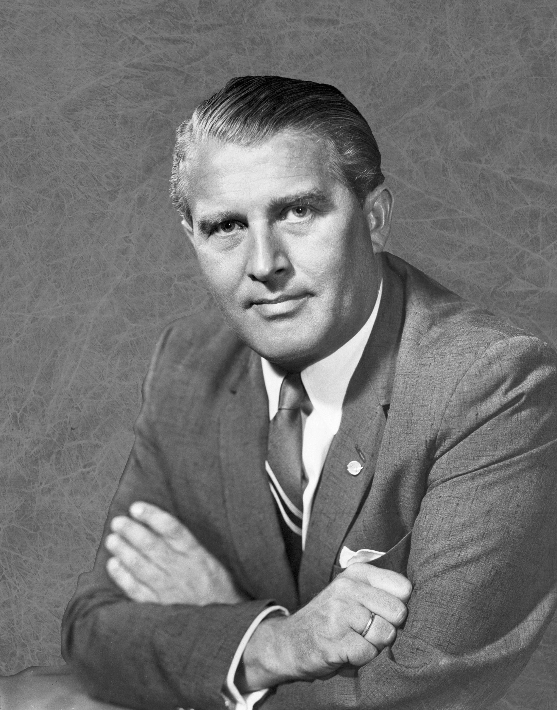

^ Von Braun built what is generally considered to be the root of all rockets, which was known as the A series. In 1942 one of his rockets was the first to cross the Karman line. The Karman line is named after Theodore von Karman, who calculated that at an altitude of 100km, the air is so thin that the velocity required for wings to provide lift is the same as orbital velocity. 99% of the air in our atmosphere is below that line. It's universally recognized as the line separating space. The most famous of those rockets was publicly known as the V2 rocket.

---

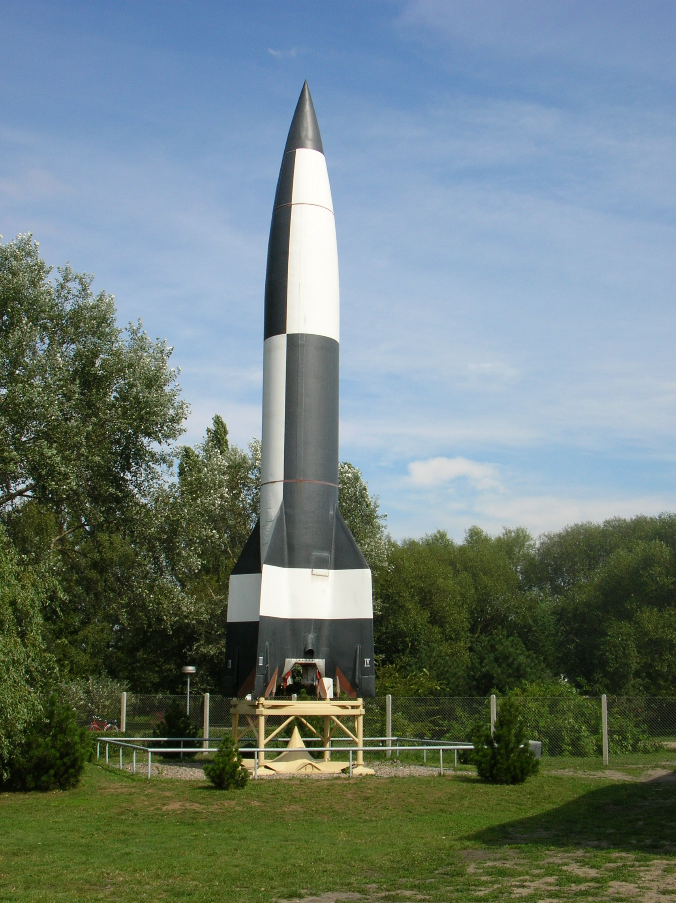

^ The V-2 (or A4) as it was known to its creators was the first guided missile ever used, and it was used by the Nazis against Britain. It wasn't terribly accurate, and did more damage to civilians than it did to the military. The war ended before the program was able to develop anything of significant military value. Still, after the war ended the potential was seen, and the US and Soviets scooped up as many German rocket scientists as they could. Oberth and von Braun were the most well known and both went to America, but many joined the Soviet Union as well.

^ After the war, the Soviet rocket program was primarily led by a man named Sergei Korolev.

---

# Sergei Korolev

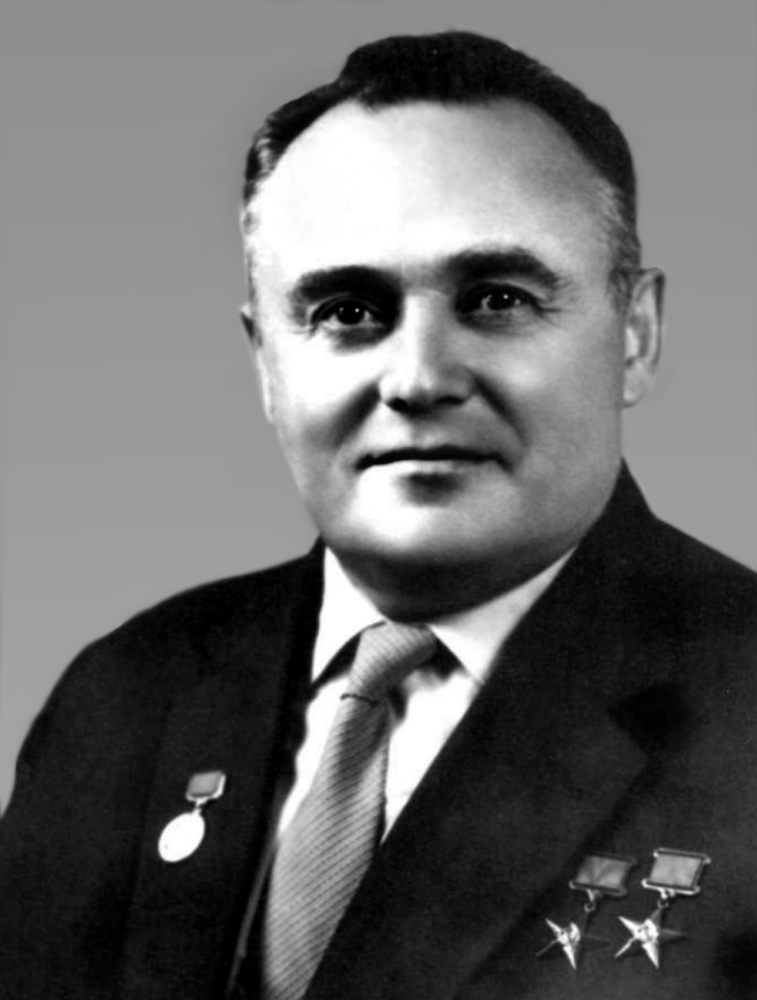

^ They first built the R-1 rocket, which was a pure clone of the V2 but entirely Soviet manufactured. This gave them valuable experience to construct more involved rockets. Soon the cold war would begin, and the US and the Soviet Union wanted to demonstrate that they could blow each other up. The V2 didn't have nearly enough range, so in 1950 a decree was given authorizing the research project titled "Development requirements for a liquid rocket with a range of 5,000 to 10,000 km and a warhead of 1 to 10 metric tons"

^ The result of this program was what could be considered the single largest contribution to spaceflight. The R-7 rocket.

---

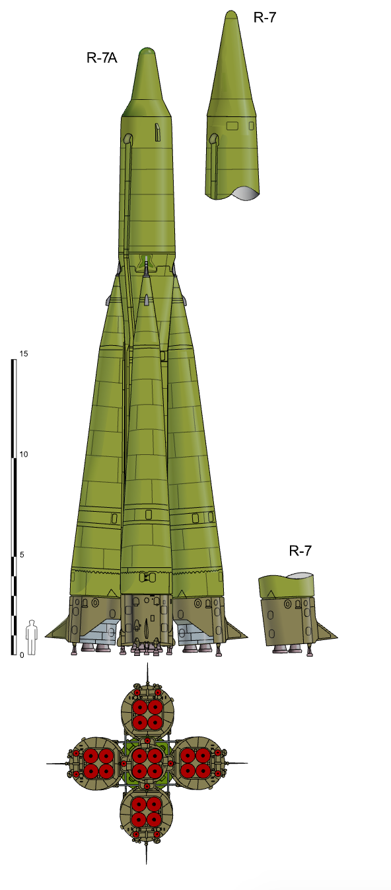

^ The R7 Semyorka was a two stage rocket. There were 4 strap-on boosters, each powered by an RD-107 engine. At a pre-determined speed which would be reached roughly 2 minutes after lift-off, the boosters would fall away leaving the core which was powered by a single RD-108 engine that would continue until the required velocity was reached.

^ Now it's worth noting that this rocket wasn't built just for the sake of building it.

---

## Build something that fills a concrete need

^ This missile was never put into production as a weapon of war, but it did end up being used for one very important little silver ball.

---

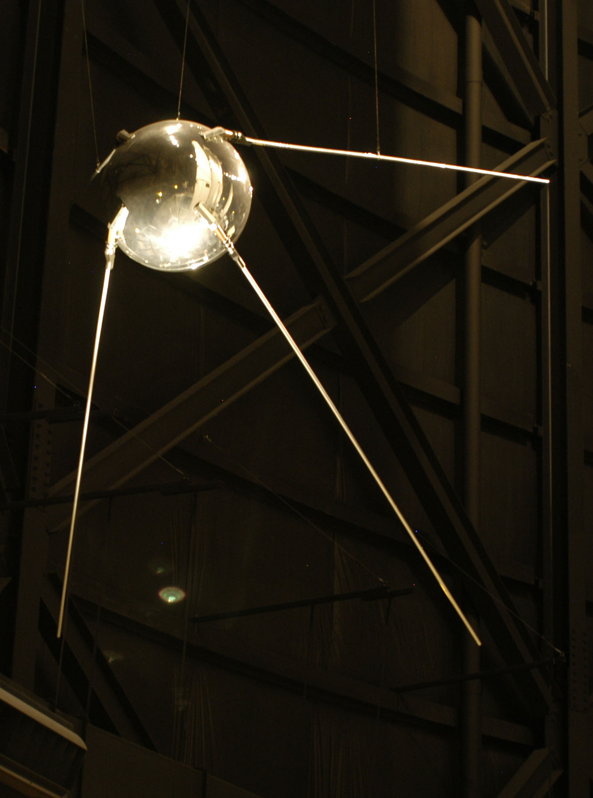

^ In 1957, an R7 was used to launch Sputnik 1. What's interesting to me about this satellite was that it had no scientific instruments. The majority of the mass was devoted to the battery. Its job was to orbit around the Earth and beep.  Anyone with a normal radio could pick up the signal, and for 22 days it circled the earth at an altitude of 650km. Heavier payloads with more science would come later.

---

# Start Simple

## Do the bare minimum required to get on people's radar

---

# Meanwhile in America

---


---


---

# RD-107/108

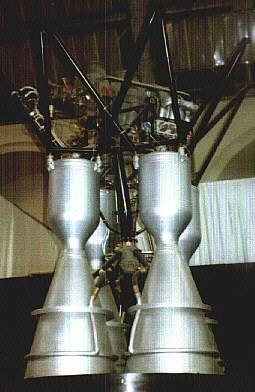

^ This engine has been a workhorse. There have been over 1700 flights of rockets derived from the R7. That's 1700 times 5 engines per rocket times four chambers per engine, plus all the ground test models. That's a LOT of engines.

^ The engines on the R7 were very unique at the time. Despite the appearance, this is one engine, not four. It had a single turbopump, but four separate combustion chambers. The engines themselves were fixed in place, and vernier nozzles were used for steering. There were 2 verniers on each of the RD-107s, and 4 verniers on the RD-108. This made the craft very stable, and it had a large degree of attitude control. The design with four combustion chambers was also a great boon during the evolution of this engine. It was very easy for the design of a single engine to be proven out, and then scale it up to four.

---

# Make it easy to experiment

^ This meant that the engine could continually receive very small improvements to thrust or fuel consumption over its lifespan.

^ Another interesting aspect of the design was how they launched it. American rockets at the time used a single engine, and had clamps which would hold the rocket down until after ignition was confirmed. The R7 had no clamps. Instead they would ignite the boosters, and once ignition was confirmed they would ignite the core. The boosters didn't have enough thrust to lift the rocket alone, and once the core ignited the rocket would ascend from the thrust alone.

---

# Cut needless features

^ This, along with some other clever design hacks meant that the launch pad could have a very simple design, and the Baikonur Cosmodrome was able to be set up very quickly. This is part of why Russia was able to beat America into orbit.

---

## When are you going to talk about Rails?

^ Ok fine, so let's talk about Rails a bit.

---

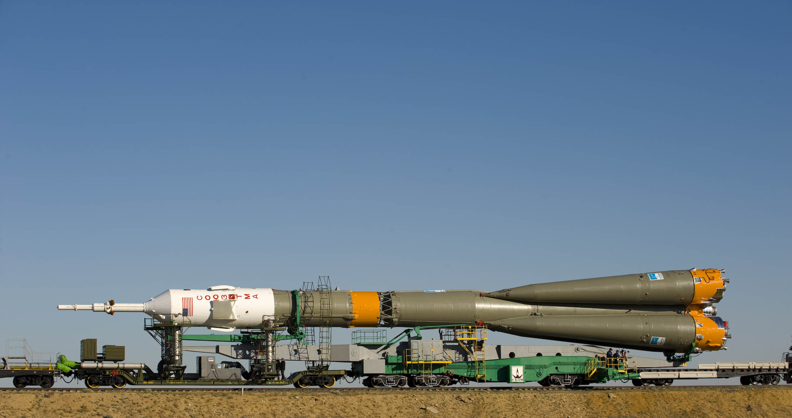

^ So one of the really cool things about the R7 family is that they get transported to the launch site by train. The rocket was assembled horizontally, transported to the pad, and then brought vertical on the pad. This was much more practical, which is why modern companies like SpaceX do the same thing.

---

# Design for portability

^ The Americans by contrast would frequently assemble their rockets on the pad.  Once NASA was formed, they would go on to build the VAB so they'd at least have a building to do it in. And then this beast...

---

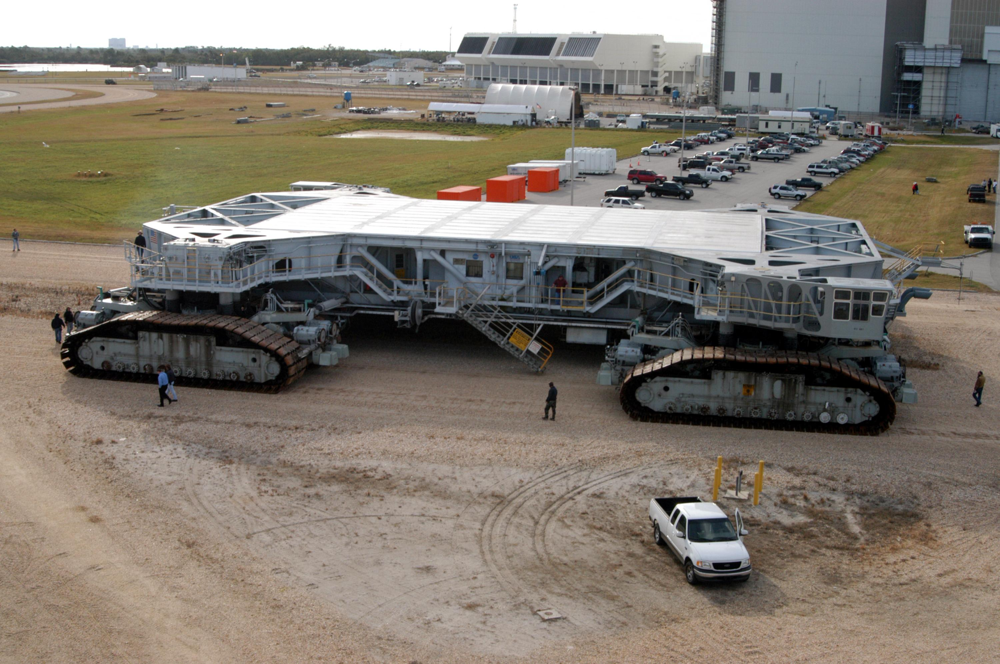

^ Called the crawler would be used to roll the rocket out to the pad over hours or even days. It's effective, but hilariously inefficient for smaller rockets.

^ And since America doesn't have a great rail system anymore, individual components have to get shipped by plane. So we also have this beast...

---


^ This is a real plane, used by NASA. It's called the Super Guppy. The front of it sort of swings open like a door.

---


^ And the cargo is loaded inside and it flies to Florida. Also the Shuttle would get transported like this.

---


^ Which actually makes sense and isn't so ridiculous, but still looks really funny to me.

^ Now there were definitely drawbacks to the approach that Russia took. The problem with shipping by train is that it doesn't scale up. Part of the reason that the Soviet N1 failed is that the infrastructure for dealing with such large rockets wasn't in place.

---

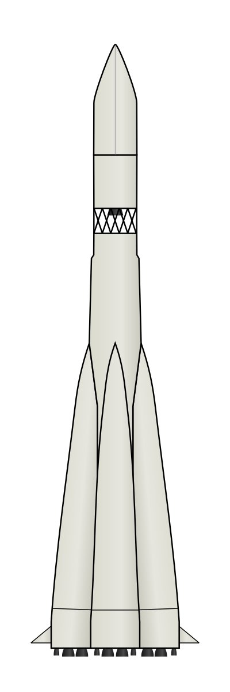

^ So moving on, the next evolution of the R7 was the launcher for the Luna probes. the core was unchanged, but a third stage was added. The third stage was known as the Blok-E, and was powered by a single RD-0105 engine. What's amazing is that it was able to "just work" on top of the existing R7 base, and all of the sudden you have a rocket that could just barely put something in orbit, which can now go to the moon.

---

## Modular design allows for rapid iteration

^ After the Blok E was added, the 8K71 core was upgraded to the 8K74 which gave us the Vostok-K. These changes were able to be introduced and test in complete isolation, allowing for much larger teams to work on the project and iterate much more quickly. From there the craft was rated for human flight, giving us the Vostok-L which did another vary famous flight.

---

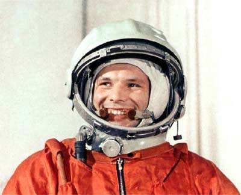

^ On April 12, 1961 onboard Vostok 1, Yuri Gagarin became the first person in space, and the first person to orbit the earth. Now interestingly enough, at the time Gagarin was not supposed to have been recognized for this record. This is because the FAI rules in 1961 required that the pilot must land with their craft. However, the Vostok wasn't equipped with parachutes large enough to do that. Instead the cosmonauts had an ejector seat which they would use at 7km up, and parachute back down to the ground.

---

## Make your requirements flexible

^ Of course that technicality hasn't affected Gagarin's legacy. Of course he was the first person in space and the first person to orbit the Earth. I think part of why Vostok 1 is so historic is that unlike the US, Russia started the space race at a massive disadvantage. So much of the country had been devastated by WWII, while the US was pissed that we had one harbor get attacked. The fact that Russia led the space race for so long at such a massive disadvantage is astonishing, and makes the achievement of Gagarin and the Russian people that much more amazing.

---


^ Continuing with the history of the R7, the Blok E was expanded, creating the Blok I. And additional stage called the Blok L was added to give us the Molniya craft. The Blok L brought with it one of the largest innovations of Russian spacecraft, a closed cycle staged combustion engine. I won't get into the technical details of how staged combustion works, but the important aspect of it is that it wastes significantly less fuel compared to gas cycle engines. Staged combustion would eventually be adopted by the Americans in the Space Shuttle.  Now what's important to note is that the development of staged combustion didn't replace everything beneath it. The core was unchanged. The Blok I was expanded, but was still the same breed that powered the Blok E.

---

### New innovations don't have to replace everything that supports it

^ The Molinya had a huge increase in performance, and powered the Venera and Mars probes, which were the first probes to explore Venus and Mars respectively.

---

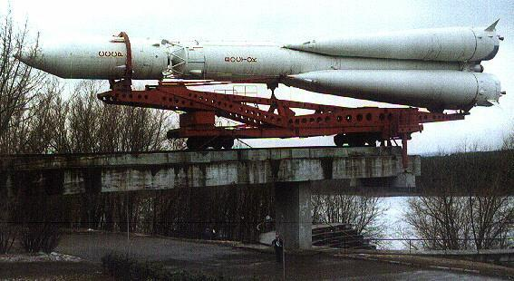

^ The next evolution of the R7 was the Voshkod craft. This took the Blok I third stage of the Molinya, but did not have the Blok E. It was human rated, and powered crewed spaceflights from 1963 until 1976. These crafts were not mutually exclusive. 300 Voshkods were launched, many of which were crewed. In 1964 the Molniya would be upgraded to the Molniya-M. Around 300 of those would be launched, powering interplanetary travel and heavy payloads to LEO or GTO. The Molniya-M remained in service until 2010. Also in 1964 the Vostok was upgraded to the Vostok-2M. This was the workhorse for lighter payloads, and remained in service until 1991.

---


^ So I want to focus on the R7, but it's worth mentioning the other Russian workhorse which came about around this time. The Proton was a super heavy launch vehicle developed as a foil to the N1. Korolev was strongly against this rocket, as unlike the R7 family which was powered entirely by RP1 Kerosene and Liquid Oxygen, this is powered by Unsymmetrical DiMethal Hydrazine and Nitrogen Tetroxide. Or UDMH and NTO for short.

^ I don't really know how this fits into the metaphors. It's big, overly simple, and gets the job done. But it's completely toxic and might kill you. So I guess it kind of reminds me of Go...

---

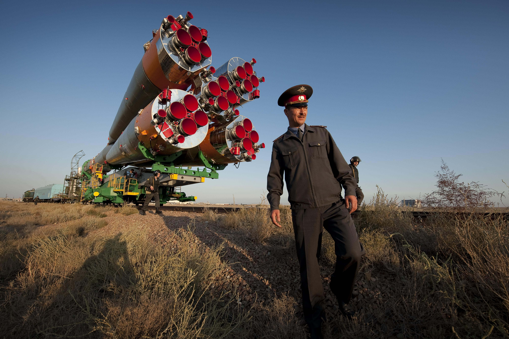

^ Now we get to the big one. 1966 the first Soyuz craft was flown. We would see all other R7 variants begin to be phased out and standardized into the Soyuz.  The original Soyuz was essentially a beefed up Voshkod, with a more powerful Blok I. It flew 30 flights from 1966 until 1975. It was replaced by the Soyuz-L, and then the Soyuz-M which flew less than a dozen flights between them.

---

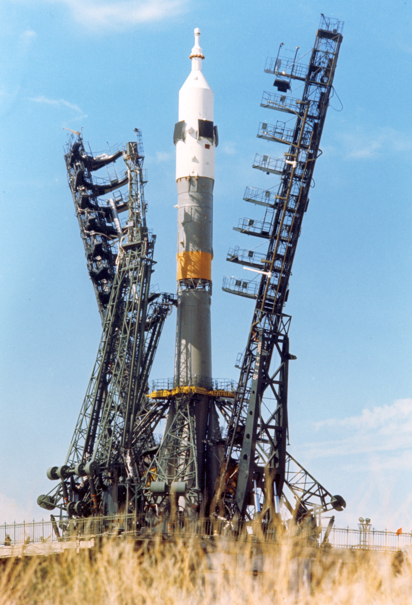

^ The Soyuz-U. This is the single most flown rocket on the planet. Once again, it features an improved Blok I and is optionally configured with two additional upper stages called the Fregat and the Ikar. This beauty has flown 784 times since 1973, and it is still flown today. It was originally used for crewed missions, but that is no longer the case. Crewed flights eventually moved to the Soyuz-U2, which is now retired. Current crewed flights are done on the Soyuz-FG.

^ This is the spacecraft that helped to build the International Space Station.  It's the craft that still today maintains it. America may have landed on the moon, but ultimately what we built were big flashy things that didn't last.  America may have won the space race, but where did that get us? We have a bunch of really expensive projects that we had to pay for. NASA pays Russia for tickets to the space station today. We maybe will eventually have the SLS, which is billions of dollars over budget and years behind schedule. So fuck the space race. Russia won the space marathon.

^ The Soyuz-U ended production in 2015. It will have it's final flight in February. The R7 will live on through the Soyuz 2, but the Soyuz-U will end its reign as the longest lived and most flown spacecraft in history. What's unfortunate about this is that the Soyuz-U didn't die because of technical reasons.

---


^ It was politics. Several of the components in the Soyuz-U were produced in Ukraine, so the transition to the Soyuz 2 has been pushed forwards. And I think we can see this as a cautionary tale in open source.

---

## Don't let politics overrun your project

^ I think this is especially worrying in projects with a particularly opinionated BDFL. A successful project is at the end of the day run by its community, not the whims of a single person. I think that is the key to true longevity.

---

# But what about Rails?

^ Ok, fine. I will stop Stalin. I've been Putin this off for too long. I hope you don't give this talk low Marx for having so many spaceships.

---

## We need to take stability more seriously

^ Rails is now in a transitionary period where we're becoming a more mature platform. We're starting to see adoption in enterprise. And that means that we need to pay a lot more attention to backwards compatibility going forward

---

## We need to continue to grow our community

^ I think one of the biggest benefits Rails has is the size and scope of the people who work on it. However, I think we still have a lot of work to do to make the project more welcoming to a more diverse group of people. Ultimately a project is run by its community, so we need to ensure that ours remains vibrant.

---

## We need to make the code base more approachable

^ A lot of work has been going into refactoring the codebase, and that needs to continue. Rails is ultimately just a large legacy codebase and has all of the problems that come with it. We still have some major big scary code monsters hiding around, and we need to make sure that code can be approached by new contributors.

---

# Questions?

- sean@seantheprogrammer.com
- @sgrif
- bikeshed.fm
- diesel.rs
