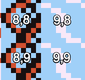
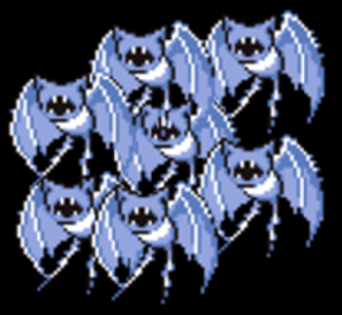
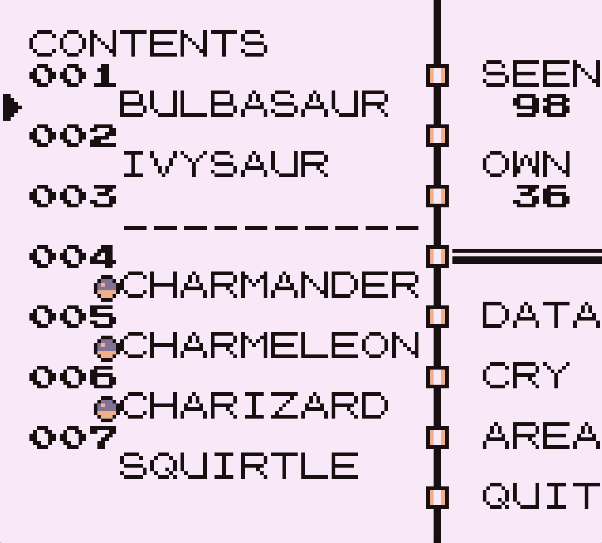

# Learning Empathy From Pokemon Blue

---

# Siân Griffin

---

# Siân Griffin

---

# they/them

---

# Let's talk about Pokemon

---


^ The first Pokemon game was made by a small team for Japanese audiences. The game was made on a very small budget, and the programming team was only 4 people. In 1996 Pokemon Red and Green were released and sales vastly exeeded expectations.

---


^ Later that year an updated version was released in Japan with improved graphics and more polish. After it was clear this game was far more popular than anybody expected, there was a mad rush to localize it for international audiences.

---


^ 2 years later in 1998, Pokemon Red and Blue were released to the rest of the world, and would go on to be the highest grossing media franchise of all time, eclipsing even Mickey Mouse and Hello Kitty.

---


^ Even if you've never played Pokemon I'll wager you've seen this one before. This is an actual picture of Ryan Reynolds in 1998. Ok not really, this is Pikachu, by far the most famous Pokemon, but there was a close second.

---


^ This is MissingNo. You could only encounter this Pokemon through a glitch, but

---

# Almost everyone knew about this glitch

^ One of the things that I find most fascinating about this glitch is how wide spread it was. In a survey I ran, 87% of people who owned the game knew about the glitch when it was relevant, and 80% of those people heard about it through word of mouth -- not the internet. And there was a good reason

---

# MissingNo could duplicate items

^ This glitch had a lot of names. The MissingNo glitch, or the item dupe glitch. At my school it was called the Rare Candy glitch, since most people used it to duplicate an item with that name. It made your pokemon more powerful when you used it, so it was a really desirable item to duplicate. Let's take a look at how you performed the glitch.

---


^ We start of in Viridian City, one of the earliest areas in the game. We're going to talk to this old man and tell him we're not in a hurry.

---


---


---


---

# ...What?

^ If you've never seen this glitch before, this probably seems like an extremely random sequence of events for such a specific outcome. And it is, but let's break down each piece of this.

---

# This glitch is not
# a single bug

^ As with most major glitches, there's no *single* bug that's responsible here. This happens because of a bunch of different bugs, and in most cases you can't even really call them bugs -- just properties of the code being used in unexpected ways.

---

# Warning
## This talk contains speculation

^ I want to state up front, I did not work on this game nor have I interviewed the programmers who did. I think we can infer a lot about what was intended in the code, and the constraints they worked under. But I want to make it clear that a lot of this is speculation.

---

## Let's break this glitch down

^ With that out of the way, let's start going through each of the pieces of this glitch. 

---

# What's up with that coast?

---


---


---



---

```rust
let tile = tile_at(9, 9);
let encounter_rate = if tile.is_grass() {
  current_area.grass_encounters.rate
} else if tile.is_water() {
  current_area.water_encounters.rate
} else {
  return;
};

// check if random encounter happens from rate

let tile = tile_at(8, 9);
if tile.is_water() {
  perform_encounter(current_area.water_encounters.pokemon)
} else {
  peform_encounter(current_area.grass_encounters.pokemon)
}
```

---

[.code-highlight: 1]

```rust
let tile = tile_at(9, 9);
let encounter_rate = if tile.is_grass() {
  current_area.grass_encounters.rate
} else if tile.is_water() {
  current_area.water_encounters.rate
} else {
  return;
};

// check if random encounter happens from rate

let tile = tile_at(8, 9);
if tile.is_water() {
  perform_encounter(current_area.water_encounters.pokemon)
} else {
  peform_encounter(current_area.grass_encounters.pokemon)
}
```

---

[.code-highlight: 2-8]

```rust
let tile = tile_at(9, 9);
let encounter_rate = if tile.is_grass() {
  current_area.grass_encounters.rate
} else if tile.is_water() {
  current_area.water_encounters.rate
} else {
  return;
};

// check if random encounter happens from rate

let tile = tile_at(8, 9);
if tile.is_water() {
  perform_encounter(current_area.water_encounters.pokemon)
} else {
  peform_encounter(current_area.grass_encounters.pokemon)
}
```

---

[.code-highlight: 10]

```rust
let tile = tile_at(9, 9);
let encounter_rate = if tile.is_grass() {
  current_area.grass_encounters.rate
} else if tile.is_water() {
  current_area.water_encounters.rate
} else {
  return;
};

// check if random encounter happens from rate

let tile = tile_at(8, 9);
if tile.is_water() {
  perform_encounter(current_area.water_encounters.pokemon)
} else {
  peform_encounter(current_area.grass_encounters.pokemon)
}
```

---

[.code-highlight: 12]

```rust
let tile = tile_at(9, 9);
let encounter_rate = if tile.is_grass() {
  current_area.grass_encounters.rate
} else if tile.is_water() {
  current_area.water_encounters.rate
} else {
  return;
};

// check if random encounter happens from rate

let tile = tile_at(8, 9);
if tile.is_water() {
  perform_encounter(current_area.water_encounters.pokemon)
} else {
  peform_encounter(current_area.grass_encounters.pokemon)
}
```

---

[.code-highlight: 13-17]

```rust
let tile = tile_at(9, 9);
let encounter_rate = if tile.is_grass() {
  current_area.grass_encounters.rate
} else if tile.is_water() {
  current_area.water_encounters.rate
} else {
  return;
};

// check if random encounter happens from rate

let tile = tile_at(8, 9);
if tile.is_water() {
  perform_encounter(current_area.water_encounters.pokemon)
} else {
  peform_encounter(current_area.grass_encounters.pokemon)
}
```

---

[.code-highlight: 1,12]

```rust
let tile = tile_at(9, 9);
let encounter_rate = if tile.is_grass() {
  current_area.grass_encounters.rate
} else if tile.is_water() {
  current_area.water_encounters.rate
} else {
  return;
};

// check if random encounter happens from rate

let tile = tile_at(8, 9);
if tile.is_water() {
  perform_encounter(current_area.water_encounters.pokemon)
} else {
  peform_encounter(current_area.grass_encounters.pokemon)
}
```

---


---


---

[.code-highlight: 1,12]

```rust
let tile = tile_at(9, 9);
let encounter_rate = if tile.is_grass() {
  current_area.grass_encounters.rate
} else if tile.is_water() {
  current_area.water_encounters.rate
} else {
  return;
};

// check if random encounter happens from rate

let tile = tile_at(8, 9);
if tile.is_water() {
  perform_encounter(current_area.water_encounters.pokemon)
} else {
  peform_encounter(current_area.grass_encounters.pokemon)
}
```

---

# Rust isn't Assembly

---

[.code-highlight: 1,12]

```rust
let tile = tile_at(9, 9);
let encounter_rate = if tile.is_grass() {
  current_area.grass_encounters.rate
} else if tile.is_water() {
  current_area.water_encounters.rate
} else {
  return;
};

// check if random encounter happens from rate

let tile = tile_at(8, 9);
if tile.is_water() {
  perform_encounter(current_area.water_encounters.pokemon)
} else {
  peform_encounter(current_area.grass_encounters.pokemon)
}
```

---

[.code-highlight: 10]

```rust
let tile = tile_at(9, 9);
let encounter_rate = if tile.is_grass() {
  current_area.grass_encounters.rate
} else if tile.is_water() {
  current_area.water_encounters.rate
} else {
  return;
};

// check if random encounter happens from rate

let tile = tile_at(8, 9);
if tile.is_water() {
  perform_encounter(current_area.water_encounters.pokemon)
} else {
  peform_encounter(current_area.grass_encounters.pokemon)
}
```

---

[.code-highlight: 1,12]

```rust
let tile = tile_at(9, 9);
let encounter_rate = if tile.is_grass() {
  current_area.grass_encounters.rate
} else if tile.is_water() {
  current_area.water_encounters.rate
} else {
  return;
};

// check if random encounter happens from rate

let tile = tile_at(8, 9);
if tile.is_water() {
  perform_encounter(current_area.water_encounters.pokemon)
} else {
  peform_encounter(current_area.grass_encounters.pokemon)
}
```

---

# Could you write your whole program with only 4 global variables?

---

# But how is this useful?

---

```rust
let grass_encounter_rate = GRASS_ENCOUNTERS[area_id].rate;
if grass_encounter_rate > 0 {
  current_area.grass_encounters = GRASS_ENCOUNTERS[area_id];
}
```

---

[.code-highlight: 1]

```rust
let grass_encounter_rate = GRASS_ENCOUNTERS[area_id].rate;
if grass_encounter_rate > 0 {
  current_area.grass_encounters = GRASS_ENCOUNTERS[area_id];
}
```

---

[.code-highlight: 2-5]

```rust
let grass_encounter_rate = GRASS_ENCOUNTERS[area_id].rate;
if grass_encounter_rate > 0 {
  current_area.grass_encounters = GRASS_ENCOUNTERS[area_id];
}
```

---

## We can keep the grass encounters from other areas

^ And that's why we specifically do this on Cinnabar Island. Because we can fast travel to any town, it's easy for us to get to this coast in particular without ever passing through an area with grass pokemon

---


---


---


---


---

# IT'S ALL ZUBAT

---


---




---


---


---


---


---


---


---

# What is a MissingNo

^ So let's talk about what a MissingNo actually is. Contrary to what you might think, it's not a single pokemon. There are actually 39 distinct Pokemon which are all called MissingNo. It's not just reading garbage data.

---


^ Even though its sprite is clearly garbage data, it has a well defined name, and a lot of other attributes. To understand why some of its attributes are garbage, but others aren't, we need to see how pokemon are stored in the code.

---



^ When most people think of a list of pokemon, they think of the order they appear in the pokedex -- the in game encyclopaedia. Every pokemon has a number associated with it, and they're loosly ordered in the order you would encounter them. But that's not how they're stored in the game. This is the pokemon with the internal id of 1

---


^ In the code, most of the data related to pokemon is stored in the order the pokemon were created. The game was originally supposed to have 190 pokemon, but it shipped with 151. MissingNo is what's stored in slots where the cut pokemon were supposed to be. For the most part, the entries for MissingNo are always zeroed out, but there are some exceptions like its name. So for anything ordered by internal ID, we get well defined (but zeroed) data. But for anything stored in dex order, we get garbage.

---

```rust
let dex_id = 0u8;
let index = dex_id - 1; // underflows to 255
unsafe {
  // MON_DATA has 151 entries, so this is a buffer overrun
  let data = MON_DATA.get_unchecked(index)
}
```

^ The "pokemon base stats" table, which includes the pointer to the sprite, is an example of something stored in dex order.

---

[.code-highlight: 1]

```rust
let dex_id = 0u8;
let index = dex_id - 1; // underflows to 255
unsafe {
  // MON_DATA has 151 entries, so this is a buffer overrun
  let data = MON_DATA.get_unchecked(index)
}
```

^ First, the game looks up what a pokemon's pokedex number is from its internal ID, which is 0 for missingno.

---

[.code-highlight: 2]

```rust
let dex_id = 0u8;
let index = dex_id - 1; // underflows to 255
unsafe {
  // MON_DATA has 151 entries, so this is a buffer overrun
  let data = MON_DATA.get_unchecked(index)
}
```

^ Since pokedex entries start at 1, it subtracts 1 from this number, causing us to underflow. So the index we're using is 255.


---

[.code-highlight: 3-6]

```rust
let dex_id = 0u8;
let index = dex_id - 1; // underflows to 255
unsafe {
  // MON_DATA has 151 entries, so this is a buffer overrun
  let data = MON_DATA.get_unchecked(index)
}
```

^ But the array we're indexing into only has 151 items in it, so we read way past the end of the array. In the case of the data that has the sprite, where it ends up is in the middle of the data for some trainer's parties on Route 17, which when interpreted as a pointer points to some random code related to the safari zone. The glitched sprite you see is what happens if you interpret that code as an image.

---


^ But most data isn't stored in pokedex order, so we mostly get valid data. Ironically, the pokedex itself is one of the things that isn't stored in pokedex order, so MissingNo even has a valid pokedex entry... almost. Its entry wasn't localized, and the structure is slightly different than the Japanese version, but if we look at the Japanese entry we can see the valid data.

---


^ MissingNo is the "???" pokemon, it has a placeholder height and weight, and that comment translated to "comment to be written". There are some differences between the different MissingNos though.

---


^ In fact, many of the MissingNos have unique data. 9 of them have cries that aren't 0s. A few of these entries were also used for some special cases where they needed to show pokemon sprites that weren't attached to real pokemon. These would only show up if you had a lower case w, x, or y in your name though, so most folks never saw them.

---

# Which versions you saw were based on your name

^ This is why you would see high level real pokemon in addition to missingno. Printable characters start at 128 in their text encoding, so no matter what your name was, the characters that mapped to levels would be higher than they're supposed to. You could also get some glitched trainer battles, but those only appeared if you had punctuation in your name, so most people were unaware. Now you might be asking... If the encounter table was based on your name,

---

# Why could everyone perform this glitch?

^ Why could everyone do the glitch? Surely it would be possible to have a name that didn't map to MissingNo at all? And this is sorta true, it was possible to have a name that didn't include missingno. But even if that was the case, you could still get 128 rare candies, and it was pretty unlikely you'd have a name that didn't include MissingNo, for a few reasons

---

# The end of name marker mapped to MissingNo

^ The control character used for the end of your name was stored as 80 in decimal, which is one of the IDs of MissingNo. So if your name was an even number of characters, you could always encounter MissingNo

---

# Every built in name had the right characters

^ A lot of players didn't even pick their own name, they just used one of the preset ones the game offered you. By pure luck, every single one of these names has the right characters for MissingNo.

---

# The MissingNo characters were common

^ The characters that mapped to MissingNo included upper case S, H, and M, and most lower case vowels. The odds of you having one of these in the right place were really high. But even then, there was a catch all.

---


^ Every custom name could at least encounter MissingNo's sister, 'M. We call it that because those are the only characters in its name you can say.

---


^ Even though they have the same sprite, 'M is different. As you can probably tell from the weird characters in its name and its decision not to wear a mask, *everything* about 'M is garbage. The graphics that appear in its name will be based on things like your party's stats or your position on the map. 'M is what you get for internal ID 0, so you get garbage even for data that isn't in pokedex order. 'M had some interesting differences from MissingNo. Its cry will randomly change based on what screen you're on, and it could evolve into Kangaskhan.

---


^ So you know, I guess this is what a baby kangaskhan looks like

---


^ You could also lock up your game by catching it. But if your goal was just to get 128 rare candies, it didn't matter if you saw MissingNo or 'M.

---

## How you get your rare candies

^ So now let's talk about why the 6th item in your inventory gets duplicated. This has to do with what happens after you encounter a pokemon.

---


^ This all has to do with that pokedex we mentioned earlier. Its function in the game is to keep track of every pokemon you've seen or caught. Any pokemon that appears on this list is one that you've seen, and the little ball icon means it's been caught. This is stored in memory as a bitmap, one bit per pokemon. As you might have guessed, this is stored in pokedex order. When you encounter missingno, it tries to mark that you've encountered a hypothetical 256th pokemon. Since there are only 151 in the game, this ends up writing past the space used for this.

---


^ Immediately after your pokedex data in RAM is your inventory. It ends up setting the high bit of the 13th byte after the end of your pokedex. The inventory is stored as 1 byte for the number of items in your inventory, followed by 1 byte for each item's ID and then 1 byte for the quantity. This means the byte it writes to is the quantity of the 6th item in your inventory. Or to put it another way, it adds 128 of that item, as long as you had less than 128 before.

---

# MissingNo also corrupted the Hall of Fame

^ If you had beaten the game when you performed this glitch, you'd also find that the place where it stored the team you beat the game with was corrupted. This is caused by MissingNo's sprite. Remember when I pointed out that the pause at the start of the fight was abnormally long? This is why. Due to the amount of space needed, sprites get decompressed on the cartridge's storage instead of the console's RAM. The space they use is large enough for 7x7 sprites, the largest in the game. But the data it tries to read says it's 13x13, so they write way past the end of that buffer, and overwrite the Hall of Fame. The data it was overwritten with was consistent for everybody.

---

# The sprite decompression was only meant to handle trusted input

^ This bug would have been avoided if there was some bounds checking in sprite decompression. But everything in this game was optimized for code size, and if you're only dealing with a known set of trusted inputs, omitting those seems perfectly reasonable. The only reason the code misbehaved was because of an unrelated bug causing it to get garbage data.

---

# Not everything you heard was true

^ And those are the only two abnormal effects of the encounter. But remember that the main way this glitch spread was through word of mouth. That means that there were a lot of untrue or half true rumors that spread around

---

## MissingNo was safe to catch

^ The biggest piece of misinformation you probably heard was "don't catch MissingNo or it'll corrupt your save". This is just straight up false.

---


^ There's really no ill effects of catching MissingNo, and there's nothing about it that can't be saved normally. I think the source of this misinformation is a very specific problem that can arise with 'M. In the games you can bring up to 6 pokemon with you, and if you catch one when your party is full, it gets sent to storage. When you open up the storage system, the game has to re-compute the stored pokemon's stats. There's a bug in this calculation that will cause an infinite loop if it tries to compute them for a level 0 pokemon. Since everyone with a custom name could encounter a level 0 'M, and it probably went to storage if you caught it, I believe this is the source of that rumor.

---

# MissingNo wouldn't corrupt your graphics

^ Another thing you might have heard is that catching MissingNo will cause all sorts of graphical glitches. Nintendo even put out a statement saying to try releasing it to fix scrambled graphics, and if that doesn't work, you need to restart your game. All of this is nonsense.

---


^ There's a specific mirroring effect you can cause if you view the stats screen for missingno, but it only affects a specific sprite and it goes away if you view the stats screen for any normal pokemon. There were some bigger glitches if you had MissingNo in the follow up game Pokemon Yellow, but the glitch that let you encounter MissingNo was fixed in that game.

---

# Encountering MissingNo wouldn't save your game

^ I'm surprised this rumor even got started since it's so easy to verify as false. I think the source of this one was an N64 game called Pokemon Stadium. It included a feature where you could play the pokemon games on the TV, and it'd display "Saved" on the screen whenever anything was written to persistent storage. This would mean the hall of fame corruption would make that appear on screen if you were playing on the N64.

---

# Small code quirks add up to big glitches

^ So now that we've seen every piece of this glitch, we can see that it was really just a bunch of small, seemingly benign interactions between unrelated bits of code. No individual piece of this glitch stands out to me as insane or something that obviously would have been stopped in code review.

---

# Would you have foreseen these interactions?

^ When you combine all of this together, you get one of the most famous glitches of all time. But it's not the result of some horrendously bad coding or lack of QA. Every piece of this glitch was relatively benign, or due to completely unrelated parts of the code base interacting in unexpected ways. And this was hand written in assembly under massive space constraints, every instruction mattered. I certainly wouldn't have done better than they did, and I don't think anyone watching this would either.

---

# Pokemon Blue wasn't "completely broken"

^ A phrase I've heard from folks making fun of the glitches in this game is "completely broken", and I think we should just remove that from our vocabularies. In this case and many others, it's likely the software was developed under some constraints we're not aware of, and we wouldn't do better in the same circumstances

---

# I'm really glad we don't have to hand roll assembly anymore

^ To me a lot of this glitch just boils down to "because assembly". It's easy for us to take the technologies we have at our disposal today for granted. Today code size is rarely a hard constraint, and only matters because of CPU caches. We run our code on machines powerful enough we can include all sorts of safety checks and never give it another thought. But in 1996 "just use Rust" wasn't an option. Even just using C wasn't an option.

---

# Thanks to the pret team

## github.com/pret/pokered

^ There's a really high quality disassembly of the game available which I used to research this talk. It doesn't have the comments the real source would have, but an invaluable tool in preparing this talk, a huge thanks to the folks who worked on it.

---

# 🎉 Organizers 🎉

---

# 💛 Tess 💛

---

# Contact Info

- Twitter: @sgrif
- Github: @sgrif
