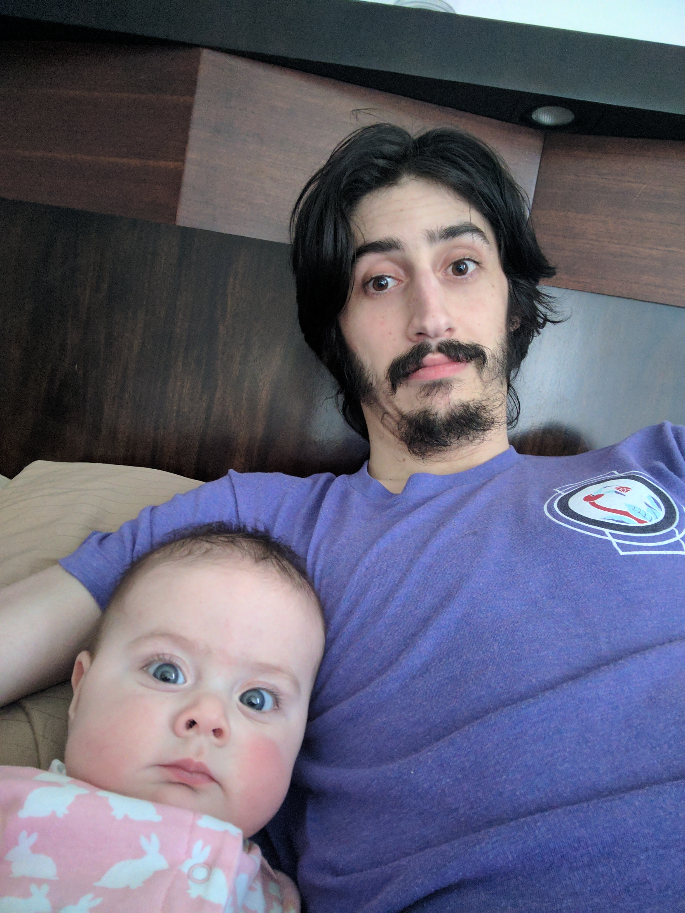

# Type System Tricks for the Real World

---

```rust


fn main() {
    break rust;
    // Can you read this color scheme?
}
```

---

# Who am I?

- Sean Griffin
- 10x Hacker Ninja Guru at Shopify
- Rails Committer
- Maintainer of Active Record
- Creator of Diesel
- Bikeshed co-host

^ I've seen my friend Steve who just introduced me give a lot of talks at Ruby conferences. At about this point he says something along the lines of "I mostly write Rust, but I still really love Ruby. And you can see how much I love it because I have one tattooed on my body". Well sorry Steve, but I'm going to have to one-up you here. You know I still love Ruby because I literally named my first born child after it.

---


---


---

# Programming is full of trade-offs

^ Ultimately the heart of software engineering is managing trade-offs. There are trade-offs in your choice of language as well. If you were to try and map out languages from high level to low level, you might put Haskell and C on opposite sides.

---
[.build-lists: true]

# Haskell

- Pros
  - Expressive type system

- Cons
  - No control over data layout

^ On the one hand we have Haskell, which has a great, flexible type system. But in return you're losing control over the layout of your data.

---
[.build-lists: true]

# C

- Pros
  - Tight control over data layout

- Cons
  - "type" system

^ On the other side you have C, which gives you very tight control over how things are laid out, but you have to give up so much to get this.

---


^ Rust loves to blow up traditional trade-offs like this. Concurrency without data races, memory safety without garbage collection, and so on. This is a big part of Rust's secret sauce. What make's it special. You could even call it...

---

# Rust's Fireflower

---

# Rust's Fireflower


---

# Rust's Fireflower

^ The combination of having control over memory layout combined with a proper type system can enable some *really* cool things. Let's look at an example. A `HashSet` is an unordered collection of unique elements. It works very much like a `HashMap` where you only look at the keys and not the values. Rust implements `HashSet` as a thin wrapper on top of `HashMap`.

---

```rust
pub struct HashSet<K> {
    map: HashMap<K, ()>
}

impl<K: Hash + Eq> HashSet<K> {
    pub fn insert(&mut self, value: K) {
        self.map.insert(value, ());
    }

    pub fn contains(&self, value: &K) -> bool {
        self.map.contains_key(value)
    }
}
```

^ Rust's implementation uses an empty tuple, also known as "unit" for the values here. The value itself doesn't matter for this implementation to be correct. For example, in Ruby they use a boolean. Here's that code:

---

```ruby
class Set
  def initialize
    @hash = {}
  end

  def insert(value)
    @hash[value] = true
  end

  def contains(value)
    @hash.key?(value)
  end
end
```

^ While both implementations are correct, there's a big difference in what's going on from a performance perspective. Specifically, Rust is able to take advantage of the fact that the value is zero sized, and eliminate a bunch of code. How big a difference? About 10-20% faster. That's free performance, and you can take advantage of those same kind of gains just by understanding some of the guarantees that Rust can provide.

---

# `char`

---

```rust


struct Foo {
    bar: char,
}
```

---

```rust


struct Foo {
    bar: char,
    baz: char,
}
```

---

```rust


enum Foo {
    Bar(char),
}
```

---

```rust, [.highlight: 7]


enum Foo {
    Bar(char),
    Baz,
}
```

---

# `struct Baz;`

---

```rust


enum Foo {
    Bar(char),
    Baz,
}
```

---

```rust, [.highlight: 7]


enum Foo {
    Bar(char),
    Baz(u64),
}
```

---

```rust


enum ListString {
    Cons {
        head: char,
        tail: ListString,
    },
    Nil,
}
```

---

```rust, [.highlight: 9]


enum ListString {
    Cons {
        head: char,
        tail: ListString,
    },
    Nil,
}
```

---

```rust, [.highlight: 5-8]


enum ListString {
    Cons {
        head: char,
        tail: ListString,
    },
    Nil,
}
```

---

```rust, [.highlight: 6]


enum ListString {
    Cons {
        head: char,
        tail: ListString,
    },
    Nil,
}
```

---

```rust, [.highlight: 7]


enum ListString {
    Cons {
        head: char,
        tail: ListString,
    },
    Nil,
}
```

---

```
error[E0072]: recursive type `ListString` has infinite size
 --> src/main.rs:1:1
  |
1 | enum ListString {
  | ^^^^^^^^^^^^^^^ recursive type has infinite size
...
4 |         tail: ListString,
  |         ---------------- recursive without indirection
  |
  = help: insert indirection (e.g., a `Box`, `Rc`, or `&`)
    at some point to make `ListString` representable
```

---

```rust


enum ListString {
    Cons {
        head: char,
        tail: ListString,
    },
    Nil,
}
```

---

```rust, [.highlight: 7]


enum ListString {
    Cons {
        head: char,
        tail: Box<ListString>,
    },
    Nil,
}
```

---

```rust


pub struct Cons<Tail> {
    head: char,
    tail: Tail,
}

pub struct Nil;
```

---

```rust


struct Pizza<Topping> {
    topping: Topping
}
```

---

```rust


struct Pinapple;

struct Pizza<Topping> {
    topping: Topping
}

size_of::<Pizza<Pinapple>>()
```

---

```rust


struct Pinapple;

struct Pizza<Topping> {
    topping: Topping
}

size_of::<Pizza<Pinapple>>() // => Error:
// Pineapple doesn't go on pizza, Steve. Fite me.
```

---

```rust


struct Pizza<Topping> {
    topping: Topping
}

size_of::<Pizza<u8>>()
```

^ If you had a pizza with a hole in it... (get it? Because it's topping is a byte)

---

```rust


pub struct Cons<Tail> {
    head: char,
    tail: Tail,
}

pub struct Nil;
```

---

# `Nil`

---

# `Cons<Nil>`

---

# `Cons<Cons<Nil>>`

---

# `Cons<Cons<Cons<Nil>>>`

---

```rust


pub struct Cons<Tail> {
    head: char,
    tail: Tail,
}

pub struct Nil;
```


---

# This isn't without tradeoffs

---


```rust


fn do_stuff_with_string(s: ListString) {
    // doing stuff!
}
```

---

```rust


fn do_stuff_with_string<T: ListString>(s: T) {
    // doing stuff!
}
```

---

```rust


fn string_contains_a(s: ListString) -> bool {
    match s {
        Cons { head: 'a', .. } => true,
        Cons { tail, .. } => string_contains_a(tail),
        Nil => false,
    }
}
```

---

```rust


fn string_contains_a<T: ListString>(s: T) -> bool {
    match s.unpack() {
        Some(('a', _)) => true,
        Some((_, tail)) => string_contains_a(tail),
        None => false,
    }
}
```

---


---

```rust


trait Robot {
    fn username(&self) -> &str;
}

fn say_hi<T: Robot>(robot: &T) {
    println!("Hi, {}", robot.username());
}
```

---

```rust
struct Bors;

impl Robot for Bors {
    fn username(&self) -> &str {
        "@bors"
    }
}
```

---

```rust
struct Bors;

impl Robot for Bors {
    fn username(&self) -> &str {
        "@bors"
    }
}

struct Alex;

impl Robot for Alex {
    fn username(&self) -> &str {
        "@alexcrichton"
    }
}
```
---

```rust, [.highlight: 3-7]
struct Bors;

impl Robot for Bors {
    fn username(&self) -> &str {
        "@bors"
    }
}

struct Alex;

impl Robot for Alex {
    fn username(&self) -> &str {
        "@alexcrichton"
    }
}
```

---

```rust, [.highlight: 3-5]
struct Bors;

fn Robot_username_Bors(_: &Bors) -> &str {
    "@bors"
}

struct Alex;

impl Robot for Alex {
    fn username(&self) -> &str {
        "@alexcrichton"
    }
}
```

---

```rust, [.highlight: 9-13]
struct Bors;

fn Robot_username_Bors(_: &Bors) -> &str {
    "@bors"
}

struct Alex;

impl Robot for Alex {
    fn username(&self) -> &str {
        "@alexcrichton"
    }
}
```

---

```rust, [.highlight: 9-11]
struct Bors;

fn Robot_username_Bors(_: &Bors) -> &str {
    "@bors"
}

struct Alex;

fn Robot_username_Alex(_: &Alex) -> &str {
    "@alexcrichton"
}
```

---

```rust


fn say_hi<T: Robot>(robot: &T) {
    println!("Hi, {}", robot.username());
}
```

---

```rust


fn say_hi_Bors(bors: &Bors) {
    println!("Hi, {}", Robot_username_Bors(bors));
}

fn say_hi_Alex(alex: &Alex) {
    println!("Hi, {}", Robot_username_Alex(alex));
}
```

---

```rust, [.highlight: 3-5]


fn say_hi_Bors(bors: &Bors) {
    println!("Hi, {}", Robot_username_Bors(bors));
}

fn say_hi_Alex(alex: &Alex) {
    println!("Hi, {}", Robot_username_Alex(alex));
}
```

---

```rust, [.highlight: 3-5]


fn say_hi_Bors(_: &Bors) {
    println!("Hi, {}", "@bors");
}

fn say_hi_Alex(alex: &Alex) {
    println!("Hi, {}", Robot_username_Alex(alex));
}
```

---

```rust, [.highlight: 7-9]


fn say_hi_Bors(_: &Bors) {
    println!("Hi, {}", "@bors");
}

fn say_hi_Alex(alex: &Alex) {
    println!("Hi, {}", Robot_username_Alex(alex));
}
```

---

```rust, [.highlight: 7-9]


fn say_hi_Bors(_: &Bors) {
    println!("Hi, {}", "@bors");
}

fn say_hi_Alex(_: &Alex) {
    println!("Hi, {}", "@alexcrichton");
}
```

^ As with all things in programming, there is a tradeoff here. In this case the cost that we're paying for the compiler to generate more efficient code is that it's increasing the size of our binary, and likely increasing compilation times as well. In some cases you can opt out of this if you'd rather not pay that cost.

---

```rust


fn say_hi(robot: &Robot) {
    println!("Hi, {}", robot.username());
}
```

^ By taking a reference to Robot, we're taking what's called a trait object. This is also sometimes referred to as "type erasure". When we take a trait object, the compiler no longer knows anything about the actual type being passed. This means that it can't do monomorphization, and the function won't be able to get optimized beyond this.

---


---

# A real world example

---

```rust


#[test]
fn complex_queries_with_no_data_have_no_size() {
    assert_eq!(0, mem::size_of_val(&users.as_query()));
    assert_eq!(0, mem::size_of_val(&users.select(id).as_query()));
    assert_eq!(0, mem::size_of_val(
        &users.inner_join(posts).filter(name.eq(title))
    ));
}
```

---
[.build-lists: true]

## List of things you can do with a 0-size type

- 

---

# `users.find(1)`

---

```
SelectStatement<
    users::table,
    DefaultSelectClause,
    NoDistinctClause,
    WhereClause<
        Eq<
            users::id,
            Bound<Integer, i32>,
        >,
    >,
    NoOrderClause,
    NoLimitClause,
    NoOffsetClause,
    NoGroupByClause,
>
```

^ In the interest of keeping things a size that fits on a slide, we're going to omit a lot this code. We'll pretend that our type only looks like this instead

---

```
SelectStatement<
    users::table,
    DefaultSelectClause,
    NoDistinctClause,
    WhereClause<
        Eq<
            users::id,
            Bound<Integer, i32>,
        >,
    >,
>
```

---

```rust
SelectStatement {
    select: DefaultSelectClause,
    from: users::table,
    distinct: NoDistinctClause,
    where_clause: WhereClause(Eq {
        left: users::id,
        right: Bound::new(1),
    }),
}
```

---

```rust
fn walk_ast(&self, out: AstPass) -> QueryResult<()> {
    out.push_sql("SELECT ");
    self.distinct.walk_ast(out)?;
    self.select.walk_ast(&self.from, out)?;
    out.push_sql(" FROM ");
    self.from.walk_ast(out)?;
    self.where_clause.walk_ast(out)?;
    Ok(())
}
```

---

```rust, [.highlight: 2]
fn walk_ast(&self, out: AstPass) -> QueryResult<()> {
    out.push_sql("SELECT ");
    self.distinct.walk_ast(out)?;
    self.select.walk_ast(&self.from, out)?;
    out.push_sql(" FROM ");
    self.from.walk_ast(out)?;
    self.where_clause.walk_ast(out)?;
    Ok(())
}
```

^ This first line says "Add this SQL string to the query being constructed". The definition of `push_sql` is going to get inlined, but we're going to leave this alone for now and come back to it later.

---

```rust, [.highlight: 3]
fn walk_ast(&self, out: AstPass) -> QueryResult<()> {
    out.push_sql("SELECT ");
    self.distinct.walk_ast(out)?;
    self.select.walk_ast(&self.from, out)?;
    out.push_sql(" FROM ");
    self.from.walk_ast(out)?;
    self.where_clause.walk_ast(out)?;
    Ok(())
}
```

---

```rust, [.highlight: 3]
fn walk_ast(&self, out: AstPass) -> QueryResult<()> {
    out.push_sql("SELECT ");
    NoDistinctClause::walk_ast(out)?;
    self.select.walk_ast(&self.from, out)?;
    out.push_sql(" FROM ");
    self.from.walk_ast(out)?;
    self.where_clause.walk_ast(out)?;
    Ok(())
}
```

---

```rust, [.highlight: 3]
fn walk_ast(&self, out: AstPass) -> QueryResult<()> {
    out.push_sql("SELECT ");
    Ok(())?;
    self.select.walk_ast(&self.from, out)?;
    out.push_sql(" FROM ");
    self.from.walk_ast(out)?;
    self.where_clause.walk_ast(out)?;
    Ok(())
}
```

---

```rust, [.highlight: 999]
fn walk_ast(&self, out: AstPass) -> QueryResult<()> {
    out.push_sql("SELECT ");
    self.select.walk_ast(&self.from, out)?;
    out.push_sql(" FROM ");
    self.from.walk_ast(out)?;
    self.where_clause.walk_ast(out)?;
    Ok(())
}
```

---

```rust, [.highlight: 3]
fn walk_ast(&self, out: AstPass) -> QueryResult<()> {
    out.push_sql("SELECT ");
    self.select.walk_ast(&self.from, out)?;
    out.push_sql(" FROM ");
    self.from.walk_ast(out)?;
    self.where_clause.walk_ast(out)?;
    Ok(())
}
```

---

```rust, [.highlight: 3]
fn walk_ast(&self, out: AstPass) -> QueryResult<()> {
    out.push_sql("SELECT ");
    DefaultSelectClause::walk_ast(&self.from, out)?;
    out.push_sql(" FROM ");
    self.from.walk_ast(out)?;
    self.where_clause.walk_ast(out)?;
    Ok(())
}
```

---

```rust, [.highlight: 3-4]
fn walk_ast(&self, out: AstPass) -> QueryResult<()> {
    out.push_sql("SELECT ");
    self.from.default_selection()
        .walk_ast(out)?;
    out.push_sql(" FROM ");
    self.from.walk_ast(out)?;
    self.where_clause.walk_ast(out)?;
    Ok(())
}
```

---

```rust, [.highlight: 3]
fn walk_ast(&self, out: AstPass) -> QueryResult<()> {
    out.push_sql("SELECT ");
    self.from.default_selection()
        .walk_ast(out)?;
    out.push_sql(" FROM ");
    self.from.walk_ast(out)?;
    self.where_clause.walk_ast(out)?;
    Ok(())
}
```

---

```rust, [.highlight: 3]
fn walk_ast(&self, out: AstPass) -> QueryResult<()> {
    out.push_sql("SELECT ");
    (users::id, users::name)
        .walk_ast(out)?;
    out.push_sql(" FROM ");
    self.from.walk_ast(out)?;
    self.where_clause.walk_ast(out)?;
    Ok(())
}
```

---

```rust, [.highlight: 3-4]
fn walk_ast(&self, out: AstPass) -> QueryResult<()> {
    out.push_sql("SELECT ");
    (users::id, users::name)
        .walk_ast(out)?;
    out.push_sql(" FROM ");
    self.from.walk_ast(out)?;
    self.where_clause.walk_ast(out)?;
    Ok(())
}
```

---

```rust, [.highlight: 3-10]
fn walk_ast(&self, out: AstPass) -> QueryResult<()> {
    out.push_sql("SELECT ");
    if 0 != 0 {
        out.push_sql(", ");
    }
    users::id.walk_ast(out)?;
    if 1 != 0 {
        out.push_sql(", ");
    }
    users::name.walk_ast(out)?;
    out.push_sql(" FROM ");
    self.from.walk_ast(out)?;
```

---

```rust, [.highlight: 3]
fn walk_ast(&self, out: AstPass) -> QueryResult<()> {
    out.push_sql("SELECT ");
    if 0 != 0 {
        out.push_sql(", ");
    }
    users::id.walk_ast(out)?;
    if 1 != 0 {
        out.push_sql(", ");
    }
    users::name.walk_ast(out)?;
    out.push_sql(" FROM ");
    self.from.walk_ast(out)?;
```

---

```rust, [.highlight: 3]
fn walk_ast(&self, out: AstPass) -> QueryResult<()> {
    out.push_sql("SELECT ");
    if false {
        out.push_sql(", ");
    }
    users::id.walk_ast(out)?;
    if 1 != 0 {
        out.push_sql(", ");
    }
    users::name.walk_ast(out)?;
    out.push_sql(" FROM ");
    self.from.walk_ast(out)?;
```

---

```rust, [.highlight: 3-5]
fn walk_ast(&self, out: AstPass) -> QueryResult<()> {
    out.push_sql("SELECT ");
    if false {
        out.push_sql(", ");
    }
    users::id.walk_ast(out)?;
    if 1 != 0 {
        out.push_sql(", ");
    }
    users::name.walk_ast(out)?;
    out.push_sql(" FROM ");
    self.from.walk_ast(out)?;
```

---

```rust, [.highlight: 999]
fn walk_ast(&self, out: AstPass) -> QueryResult<()> {
    out.push_sql("SELECT ");
    users::id.walk_ast(out)?;
    if 1 != 0 {
        out.push_sql(", ");
    }
    users::name.walk_ast(out)?;
    out.push_sql(" FROM ");
    self.from.walk_ast(out)?;
    self.where_clause.walk_ast(out)?;
    Ok(())
}
```

---

```rust, [.highlight: 4]
fn walk_ast(&self, out: AstPass) -> QueryResult<()> {
    out.push_sql("SELECT ");
    users::id.walk_ast(out)?;
    if 1 != 0 {
        out.push_sql(", ");
    }
    users::name.walk_ast(out)?;
    out.push_sql(" FROM ");
    self.from.walk_ast(out)?;
    self.where_clause.walk_ast(out)?;
    Ok(())
}
```

---

```rust, [.highlight: 4]
fn walk_ast(&self, out: AstPass) -> QueryResult<()> {
    out.push_sql("SELECT ");
    users::id.walk_ast(out)?;
    if true {
        out.push_sql(", ");
    }
    users::name.walk_ast(out)?;
    out.push_sql(" FROM ");
    self.from.walk_ast(out)?;
    self.where_clause.walk_ast(out)?;
    Ok(())
}
```

---

```rust, [.highlight: 4-6]
fn walk_ast(&self, out: AstPass) -> QueryResult<()> {
    out.push_sql("SELECT ");
    users::id.walk_ast(out)?;
    if true {
        out.push_sql(", ");
    }
    users::name.walk_ast(out)?;
    out.push_sql(" FROM ");
    self.from.walk_ast(out)?;
    self.where_clause.walk_ast(out)?;
    Ok(())
}
```

---

```rust, [.highlight: 4]
fn walk_ast(&self, out: AstPass) -> QueryResult<()> {
    out.push_sql("SELECT ");
    users::id.walk_ast(out)?;
    out.push_sql(", ");
    users::name.walk_ast(out)?;
    out.push_sql(" FROM ");
    self.from.walk_ast(out)?;
    self.where_clause.walk_ast(out)?;
    Ok(())
}
```

---

```rust, [.highlight: 3]
fn walk_ast(&self, out: AstPass) -> QueryResult<()> {
    out.push_sql("SELECT ");
    users::id.walk_ast(out)?;
    out.push_sql(", ");
    users::name.walk_ast(out)?;
    out.push_sql(" FROM ");
    self.from.walk_ast(out)?;
    self.where_clause.walk_ast(out)?;
    Ok(())
}
```

---

```rust, [.highlight: 3-5]
fn walk_ast(&self, out: AstPass) -> QueryResult<()> {
    out.push_sql("SELECT ");
    users::table.walk_ast(out)?;
    out.push_sql(".");
    out.push_identifier("id");
    out.push_sql(", ");
    users::name.walk_ast(out)?;
    out.push_sql(" FROM ");
    self.from.walk_ast(out)?;
    self.where_clause.walk_ast(out)?;
    Ok(())
}
```

---

```rust, [.highlight: 3]
fn walk_ast(&self, out: AstPass) -> QueryResult<()> {
    out.push_sql("SELECT ");
    users::table.walk_ast(out)?;
    out.push_sql(".");
    out.push_identifier("id");
    out.push_sql(", ");
    users::name.walk_ast(out)?;
    out.push_sql(" FROM ");
    self.from.walk_ast(out)?;
    self.where_clause.walk_ast(out)?;
    Ok(())
}
```

---

```rust, [.highlight: 3]
fn walk_ast(&self, out: AstPass) -> QueryResult<()> {
    out.push_sql("SELECT ");
    out.push_identifier("users");
    out.push_sql(".");
    out.push_identifier("id");
    out.push_sql(", ");
    users::name.walk_ast(out)?;
    out.push_sql(" FROM ");
    self.from.walk_ast(out)?;
    self.where_clause.walk_ast(out)?;
    Ok(())
}
```

---

```rust, [.highlight: 3-5]
fn walk_ast(&self, out: AstPass) -> QueryResult<()> {
    out.push_sql("SELECT ");
    out.push_sql("\"");
    out.push_sql(&"users".replace('"', "\"\""));
    out.push_sql("\"");
    out.push_sql(".");
    out.push_identifier("id");
    out.push_sql(", ");
    users::name.walk_ast(out)?;
    out.push_sql(" FROM ");
    self.from.walk_ast(out)?;
    self.where_clause.walk_ast(out)?;
```

---

```rust, [.highlight: 4]
fn walk_ast(&self, out: AstPass) -> QueryResult<()> {
    out.push_sql("SELECT ");
    out.push_sql("\"");
    out.push_sql(&"users".replace('"', "\"\""));
    out.push_sql("\"");
    out.push_sql(".");
    out.push_identifier("id");
    out.push_sql(", ");
    users::name.walk_ast(out)?;
    out.push_sql(" FROM ");
    self.from.walk_ast(out)?;
    self.where_clause.walk_ast(out)?;
```

---

```rust, [.highlight: 4]
fn walk_ast(&self, out: AstPass) -> QueryResult<()> {
    out.push_sql("SELECT ");
    out.push_sql("\"");
    out.push_sql("users");
    out.push_sql("\"");
    out.push_sql(".");
    out.push_identifier("id");
    out.push_sql(", ");
    users::name.walk_ast(out)?;
    out.push_sql(" FROM ");
    self.from.walk_ast(out)?;
    self.where_clause.walk_ast(out)?;
```

---

```rust, [.highlight: 6]
    out.push_sql("SELECT ");
    out.push_sql("\"");
    out.push_sql("users");
    out.push_sql("\"");
    out.push_sql(".");
    out.push_identifier("id");
    out.push_sql(", ");
    users::name.walk_ast(out)?;
    out.push_sql(" FROM ");
    self.from.walk_ast(out)?;
    self.where_clause.walk_ast(out)?;
    Ok(())
```

---

```rust, [.highlight: 5-7]
    out.push_sql("\"");
    out.push_sql("users");
    out.push_sql("\"");
    out.push_sql(".");
    out.push_sql("\"");
    out.push_sql(&"id".replace('"', "\"\""));
    out.push_sql("\"");
    out.push_sql(", ");
    users::name.walk_ast(out)?;
    out.push_sql(" FROM ");
    self.from.walk_ast(out)?;
    self.where_clause.walk_ast(out)?;
```


---

```rust, [.highlight: 6]
    out.push_sql("\"");
    out.push_sql("users");
    out.push_sql("\"");
    out.push_sql(".");
    out.push_sql("\"");
    out.push_sql(&"id".replace('"', "\"\""));
    out.push_sql("\"");
    out.push_sql(", ");
    users::name.walk_ast(out)?;
    out.push_sql(" FROM ");
    self.from.walk_ast(out)?;
    self.where_clause.walk_ast(out)?;
```

---

```rust, [.highlight: 6]
    out.push_sql("\"");
    out.push_sql("users");
    out.push_sql("\"");
    out.push_sql(".");
    out.push_sql("\"");
    out.push_sql("id");
    out.push_sql("\"");
    out.push_sql(", ");
    users::name.walk_ast(out)?;
    out.push_sql(" FROM ");
    self.from.walk_ast(out)?;
    self.where_clause.walk_ast(out)?;
```

---

```rust, [.highlight: 9]
    out.push_sql("\"");
    out.push_sql("users");
    out.push_sql("\"");
    out.push_sql(".");
    out.push_sql("\"");
    out.push_sql("id");
    out.push_sql("\"");
    out.push_sql(", ");
    users::name.walk_ast(out)?;
    out.push_sql(" FROM ");
    self.from.walk_ast(out)?;
    self.where_clause.walk_ast(out)?;
```

^ Let's scroll down to give ourselves a bit of room (3 slides)

---

```rust, [.highlight: 7]
    out.push_sql("\"");
    out.push_sql(".");
    out.push_sql("\"");
    out.push_sql("id");
    out.push_sql("\"");
    out.push_sql(", ");
    users::name.walk_ast(out)?;
    out.push_sql(" FROM ");
    self.from.walk_ast(out)?;
    self.where_clause.walk_ast(out)?;
    Ok(())
}
```

---

```rust, [.highlight: 5]
    out.push_sql("\"");
    out.push_sql("id");
    out.push_sql("\"");
    out.push_sql(", ");
    users::name.walk_ast(out)?;
    out.push_sql(" FROM ");
    self.from.walk_ast(out)?;
    self.where_clause.walk_ast(out)?;
    Ok(())
}
```

---

```rust, [.highlight: 4]
    out.push_sql("id");
    out.push_sql("\"");
    out.push_sql(", ");
    users::name.walk_ast(out)?;
    out.push_sql(" FROM ");
    self.from.walk_ast(out)?;
    self.where_clause.walk_ast(out)?;
    Ok(())
}
```

---

```rust, [.highlight: 4-6]
    out.push_sql("id");
    out.push_sql("\"");
    out.push_sql(", ");
    users::table.walk_ast(out)?;
    out.push_sql(".");
    out.push_identifier("name");
    out.push_sql(" FROM ");
    self.from.walk_ast(out)?;
    self.where_clause.walk_ast(out)?;
    Ok(())
}
```

---

```rust, [.highlight: 4]
    out.push_sql("id");
    out.push_sql("\"");
    out.push_sql(", ");
    users::table.walk_ast(out)?;
    out.push_sql(".");
    out.push_identifier("name");
    out.push_sql(" FROM ");
    self.from.walk_ast(out)?;
    self.where_clause.walk_ast(out)?;
    Ok(())
}
```

---

```rust, [.highlight: 4-6]
    out.push_sql("id");
    out.push_sql("\"");
    out.push_sql(", ");
    out.push_sql("\"");
    out.push_sql("users");
    out.push_sql("\"");
    out.push_sql(".");
    out.push_identifier("name");
    out.push_sql(" FROM ");
    self.from.walk_ast(out)?;
    self.where_clause.walk_ast(out)?;
    Ok(())
```

---

```rust, [.highlight: 8]
    out.push_sql("id");
    out.push_sql("\"");
    out.push_sql(", ");
    out.push_sql("\"");
    out.push_sql("users");
    out.push_sql("\"");
    out.push_sql(".");
    out.push_identifier("name");
    out.push_sql(" FROM ");
    self.from.walk_ast(out)?;
    self.where_clause.walk_ast(out)?;
    Ok(())
```

---

```rust, [.highlight: 8-10]
    out.push_sql("id");
    out.push_sql("\"");
    out.push_sql(", ");
    out.push_sql("\"");
    out.push_sql("users");
    out.push_sql("\"");
    out.push_sql(".");
    out.push_sql("\"");
    out.push_sql("name");
    out.push_sql("\"");
    out.push_sql(" FROM ");
    self.from.walk_ast(out)?;
```

---

```rust, [.highlight: 12]
    out.push_sql("id");
    out.push_sql("\"");
    out.push_sql(", ");
    out.push_sql("\"");
    out.push_sql("users");
    out.push_sql("\"");
    out.push_sql(".");
    out.push_sql("\"");
    out.push_sql("name");
    out.push_sql("\"");
    out.push_sql(" FROM ");
    self.from.walk_ast(out)?;
```

^ And I'm already out of space again (4 slides)

---

```rust, [.highlight: 10]
    out.push_sql(", ");
    out.push_sql("\"");
    out.push_sql("users");
    out.push_sql("\"");
    out.push_sql(".");
    out.push_sql("\"");
    out.push_sql("name");
    out.push_sql("\"");
    out.push_sql(" FROM ");
    self.from.walk_ast(out)?;
    self.where_clause.walk_ast(out)?;
    Ok(())
```

---

```rust, [.highlight: 8]
    out.push_sql("users");
    out.push_sql("\"");
    out.push_sql(".");
    out.push_sql("\"");
    out.push_sql("name");
    out.push_sql("\"");
    out.push_sql(" FROM ");
    self.from.walk_ast(out)?;
    self.where_clause.walk_ast(out)?;
    Ok(())
}
```

---

```rust, [.highlight: 6]
    out.push_sql(".");
    out.push_sql("\"");
    out.push_sql("name");
    out.push_sql("\"");
    out.push_sql(" FROM ");
    self.from.walk_ast(out)?;
    self.where_clause.walk_ast(out)?;
    Ok(())
}
```

---

```rust, [.highlight: 4]
    out.push_sql("name");
    out.push_sql("\"");
    out.push_sql(" FROM ");
    self.from.walk_ast(out)?;
    self.where_clause.walk_ast(out)?;
    Ok(())
}
```

---

```rust, [.highlight: 4-6]
    out.push_sql("name");
    out.push_sql("\"");
    out.push_sql(" FROM ");
    out.push_sql("\"");
    out.push_sql("users");
    out.push_sql("\"");
    self.where_clause.walk_ast(out)?;
    Ok(())
}
```

---

```rust, [.highlight: 7]
    out.push_sql("name");
    out.push_sql("\"");
    out.push_sql(" FROM ");
    out.push_sql("\"");
    out.push_sql("users");
    out.push_sql("\"");
    self.where_clause.walk_ast(out)?;
    Ok(())
}
```

---

```rust, [.highlight: 7-8]
    out.push_sql("name");
    out.push_sql("\"");
    out.push_sql(" FROM ");
    out.push_sql("\"");
    out.push_sql("users");
    out.push_sql("\"");
    out.push_sql(" WHERE ");
    self.where_clause.0.walk_ast(out)?;
    Ok(())
}
```

---

```rust, [.highlight: 8]
    out.push_sql("name");
    out.push_sql("\"");
    out.push_sql(" FROM ");
    out.push_sql("\"");
    out.push_sql("users");
    out.push_sql("\"");
    out.push_sql(" WHERE ");
    self.where_clause.0.walk_ast(out)?;
    Ok(())
}
```

---

```rust, [.highlight: 8-10]
    out.push_sql("name");
    out.push_sql("\"");
    out.push_sql(" FROM ");
    out.push_sql("\"");
    out.push_sql("users");
    out.push_sql("\"");
    out.push_sql(" WHERE ");
    self.where_clause.0.left.walk_ast(out)?;
    out.push_sql(" = ");
    self.where_clause.0.right.walk_ast(out)?;
    Ok(())
}
```

---

```rust, [.highlight: 8]
    out.push_sql("name");
    out.push_sql("\"");
    out.push_sql(" FROM ");
    out.push_sql("\"");
    out.push_sql("users");
    out.push_sql("\"");
    out.push_sql(" WHERE ");
    self.where_clause.0.left.walk_ast(out)?;
    out.push_sql(" = ");
    self.where_clause.0.right.walk_ast(out)?;
    Ok(())
}
```

---

```rust, [.highlight: 6]
    out.push_sql(" FROM ");
    out.push_sql("\"");
    out.push_sql("users");
    out.push_sql("\"");
    out.push_sql(" WHERE ");
    self.where_clause.0.left.walk_ast(out)?;
    out.push_sql(" = ");
    self.where_clause.0.right.walk_ast(out)?;
    Ok(())
}
```

---

```rust, [.highlight: 4]
    out.push_sql("users");
    out.push_sql("\"");
    out.push_sql(" WHERE ");
    self.where_clause.0.left.walk_ast(out)?;
    out.push_sql(" = ");
    self.where_clause.0.right.walk_ast(out)?;
    Ok(())
}
```

---

```rust, [.highlight: 2]
    out.push_sql(" WHERE ");
    self.where_clause.0.left.walk_ast(out)?;
    out.push_sql(" = ");
    self.where_clause.0.right.walk_ast(out)?;
    Ok(())
}
```

---

```rust, [.highlight: 2-4]
    out.push_sql(" WHERE ");
    users::table.walk_ast(out)?;
    out.push_sql(".");
    out.push_identifier("id");
    out.push_sql(" = ");
    self.where_clause.0.right.walk_ast(out)?;
    Ok(())
}
```

---

```rust, [.highlight: 2]
    out.push_sql(" WHERE ");
    users::table.walk_ast(out)?;
    out.push_sql(".");
    out.push_identifier("id");
    out.push_sql(" = ");
    self.where_clause.0.right.walk_ast(out)?;
    Ok(())
}
```

---

```rust, [.highlight: 2-4]
    out.push_sql(" WHERE ");
    out.push_sql("\"");
    out.push_sql("users");
    out.push_sql("\"");
    out.push_sql(".");
    out.push_identifier("id");
    out.push_sql(" = ");
    self.where_clause.0.right.walk_ast(out)?;
    Ok(())
}
```

---

```rust, [.highlight: 6]
    out.push_sql(" WHERE ");
    out.push_sql("\"");
    out.push_sql("users");
    out.push_sql("\"");
    out.push_sql(".");
    out.push_identifier("id");
    out.push_sql(" = ");
    self.where_clause.0.right.walk_ast(out)?;
    Ok(())
}
```

---

```rust, [.highlight: 6-8]
    out.push_sql(" WHERE ");
    out.push_sql("\"");
    out.push_sql("users");
    out.push_sql("\"");
    out.push_sql(".");
    out.push_sql("\"");
    out.push_sql("id");
    out.push_sql("\"");
    out.push_sql(" = ");
    self.where_clause.0.right.walk_ast(out)?;
    Ok(())
}
```

---

```rust, [.highlight: 10]
    out.push_sql(" WHERE ");
    out.push_sql("\"");
    out.push_sql("users");
    out.push_sql("\"");
    out.push_sql(".");
    out.push_sql("\"");
    out.push_sql("id");
    out.push_sql("\"");
    out.push_sql(" = ");
    self.where_clause.0.right.walk_ast(out)?;
    Ok(())
}
```

---

```rust, [.highlight: 10-11]
    out.push_sql(" WHERE ");
    out.push_sql("\"");
    out.push_sql("users");
    out.push_sql("\"");
    out.push_sql(".");
    out.push_sql("\"");
    out.push_sql("id");
    out.push_sql("\"");
    out.push_sql(" = ");
    out.push_bind_param(
        &self.where_clause.0.right.item)?;
    Ok(())
```

---

```rust
fn walk_ast(&self, out: AstPass) -> QueryResult<()> {
    out.push_sql("SELECT ");
    self.distinct.walk_ast(out)?;
    self.select.walk_ast(&self.from, out)?;
    out.push_sql(" FROM ");
    self.from.walk_ast(out)?;
    self.where_clause.walk_ast(out)?;
    Ok(())
}
```

---

```rust
fn walk_ast(&self, out: AstPass) -> QueryResult<()> {
    out.push_sql("SELECT ");
    out.push_sql("\"");
    out.push_sql("users");
    out.push_sql("\"");
    out.push_sql(".");
    out.push_sql("\"");
    out.push_sql("id");
    out.push_sql("\"");
    out.push_sql(", ");
    out.push_sql("\"");
    out.push_sql("users");
    out.push_sql("\"");
    out.push_sql(".");
    out.push_sql("\"");
    out.push_sql("name");
    out.push_sql("\"");
    out.push_sql(" FROM ");
    out.push_sql("\"");
    out.push_sql("users");
    out.push_sql("\"");
    out.push_sql(" WHERE ");
    out.push_sql("\"");
    out.push_sql("users");
    out.push_sql("\"");
    out.push_sql(".");
    out.push_sql("\"");
    out.push_sql("id");
    out.push_sql("\"");
    out.push_sql(" = ");
    out.push_bind_param(&self.where_clause.0.right.item, out)?;
    Ok(())
}
```

---

```rust, [.highlight: 2]
fn walk_ast(&self, out: AstPass) -> QueryResult<()> {
    out.push_sql("SELECT ");
    out.push_sql("\"");
    out.push_sql("users");
    out.push_sql("\"");
    out.push_sql(".");
    out.push_sql("\"");
    out.push_sql("id");
    out.push_sql("\"");
```

---

```rust, [.highlight: 2-4]
fn walk_ast(&self, out: AstPass) -> QueryResult<()> {
    if let AstPass::ToSql(ref mut builder) = out {
        builder.push_sql("SELECT ");
    }
    out.push_sql("\"");
    out.push_sql("users");
    out.push_sql("\"");
    out.push_sql(".");
    out.push_sql("\"");
    out.push_sql("id");
    out.push_sql("\"");
```

---

```rust, [.highlight: 2-3]
fn walk_ast(&self, out: AstPass) -> QueryResult<()> {
    let AstPass::ToSql(ref mut builder) = out;
    builder.push_sql("SELECT ");
    out.push_sql("\"");
    out.push_sql("users");
    out.push_sql("\"");
    out.push_sql(".");
    out.push_sql("\"");
    out.push_sql("id");
    out.push_sql("\"");
```

---

```rust, [.highlight: 3]
fn walk_ast(&self, out: AstPass) -> QueryResult<()> {
    let AstPass::ToSql(ref mut builder) = out;
    builder.push_sql("SELECT ");
    out.push_sql("\"");
    out.push_sql("users");
    out.push_sql("\"");
    out.push_sql(".");
    out.push_sql("\"");
    out.push_sql("id");
    out.push_sql("\"");
```

---

```rust, [.highlight: 3]
fn walk_ast(&self, out: AstPass) -> QueryResult<()> {
    let AstPass::ToSql(ref mut builder) = out;
    builder.sql.push_str("SELECT ");
    out.push_sql("\"");
    out.push_sql("users");
    out.push_sql("\"");
    out.push_sql(".");
    out.push_sql("\"");
    out.push_sql("id");
    out.push_sql("\"");
```

---

```rust
fn walk_ast(&self, out: AstPass) -> QueryResult<()> {
    let AstPass::CollectBinds { collector, metadata_lookup } = out;
    collector.push_bound_value(
        &self.where_clause.0.right.value,
        metadata_lookup,
    )?;
    Ok(())
}
```

---

```rust
fn walk_ast(&self, out: AstPass) -> QueryResult<()> {
    Ok(())
}
```

---

# These optimizations are what let us build zero cost abstractions

---

```rust
pub struct HashSet<K> {
    map: HashMap<K, ()>
}

impl<K: Hash + Eq> HashSet<K> {
    pub fn insert(&mut self, value: K) {
        self.map.insert(value, ());
    }

    pub fn contains(&self, value: &K) -> bool {
        self.map.contains_key(value)
    }
}
```

^ At the beginning of this talk I mentioned that using unit instead of bool was 10-20% faster, but I glossed over why that is the case. The reason is because the compiler knows that this value with 0 bytes can never be used. All of the generic code responsible for storing the values of a hash map is guaranteed to be eliminated, leaving us with the same code we'd have if we wrote a super-optimized specific hashset ourselves.

---

```rust
pub struct HashSet<K> {
    map: HashMap<K, ()>
}

impl<K: Hash + Eq> HashSet<K> {
    pub fn insert(&mut self, value: K) {
        self.map.insert(value, ());
    }

    pub fn contains(&self, value: &K) -> bool {
        self.map.contains_key(value)
    }
}
```

^ In theory the compiler could do the same optimization because it's just able to see that the values are never used. The use of a zero-sized type doesn't necessarily enable any optimizations that weren't possible before. However, they do *guarantee* that they will occur.

---


---

# Please ask me questions now



---

# Contact

- twitter: @sgrif
- github: @sgrif
- podcast: bikeshed.fm
