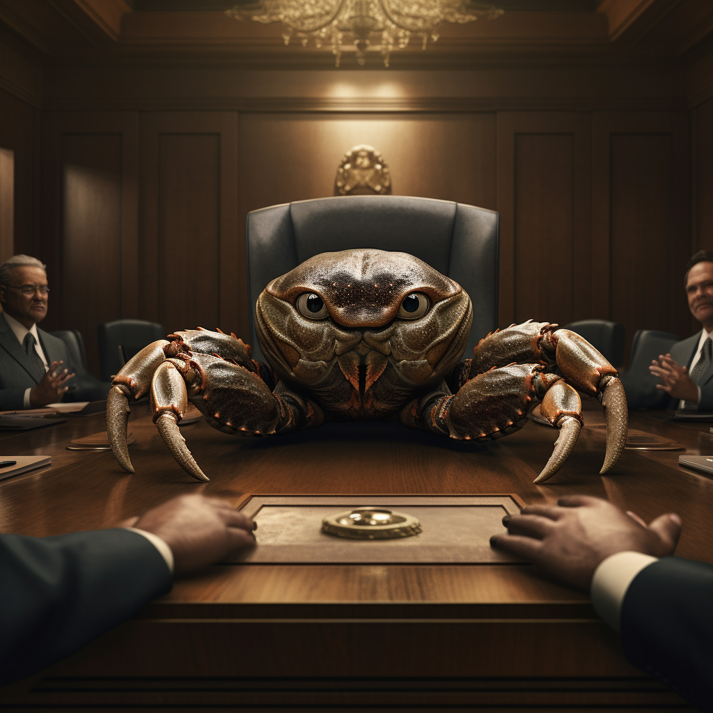

# Rust Foundation: Demystified

^ audio test on advance

---

# What we do

^ So for starters I want to talk about what the foundation actually does. To answer that question, we need to understand section 501(c)(6) of the United States Internal Revenue code which states... Ok I'm kidding -- stop running for the doors I promise we're not actually going to talk about the tax code.

---

## 501c6 screenshot

^ Although I do want you all to know that the relevant bit of the tax code specifically calls out professional football leagues, which makes me very disappointed that the Rust Foundation isn't formed as the Rust Associated Football Club. At the happy hour everyone please pester our CEO Bec to make this happen.

---

# What we do

- Support the language

^ Fundamentally, we exist to support the Rust language by providing support to the Rust Project and community. This comes in a couple of different forms

---
[.build-lists: true]

# Supporting the language

- Providing grants
- Hiring full time engineers
- Paying infrastructure costs
- Providing access to lawyers

^ At its core, the biggest thing the foundation does is raise funds from various companies who are using Rust and funnel it into the ecosystem. (next) One way this is done is through our grants program, where folks inside the project and the community submit proposals for things they'd like to work on, and they receive some amount of funding from the foundation to work on it. But depending on where in the world the grantee lives, this usually isn't enough to cover all their costs. (next) This is why when we're able we also hire full time engineers whose only job is to work on the Rust project. This is something we generally do sparingly, as we don't want to be in a situation where only a handful of people benefit from the foundation. We also need to make sure we're in a situation where we can give our engineers reasonable job security. (next)

^ But engineering costs are only one part of what it takes to run the Rust project. Rust has a lot of infrastructure that its built on top of, and this gets *very* expensive. In 2022, our members donated just shy of a million dollars in resources for Rust's CI, file hosting, bandwidth, tools like Crater which tests a change to the compiler by compiling every crate on crates.io, and more. (next)

^ And finally, the project has more legal needs than you might expect. Crates.io has to deal with copyright law (whether that's in the form of DMCA takedown requests or other forms). And the project wants to continue to hold the trademark for Rust. What needs to happen to ensure we keep it? There's also random situations that can come up like: "Rust has a lot of US contribuors. Do we need to care about the US sanctions on Iran when reviewing pull requests?". Also in most countries, people can just sue you for nearly any reason. What if you get sued for work you did on behalf of the project? All of these situations require legal resources, which the Foundation provides.

---

# Who is the Rust Project?

^ So a huge portion of support we provide goes to the Rust project, but who actually is the Rust Project? The answer to this question is surprisingly nebulous, but the short version is it's the group of people who are governed by the Rust Leadership Council. The Project is entirely independent of the Foundation, and is the sole group responsible for the decisions affecting the language. We provide support to them, and sometimes act as stewards on their behalf, but we don't have any direct control over them. We'll talk more about how that relationship is codified in a bit.

---

^ Remember folks, you need to be drinking more water at high altitude. The Rust Foundation cares about rustacean hydration, so let's take a second to drink some water.

---

# What we do

- Support the language

^ Alright so we've talked about the ways in which we support the language, but what else does the foundation do?

---

# What we do

- Support the language
- Be a legal entity

^ The next role that the foundation fills is acting as a legal entity for "Rust", when it's needed. When the foundation was originally formed, the MVP was "a legal entity that can hold the trademark that isn't Mozilla". But the need for a legal entity encompasses more than just the trademark, and I'd like to tell you about a case where this happened during my time as the crates.io team lead. This happened years ago, long before the foundation existed. Github token scanning was in an early preview stage. At this point there wasn't easy way for projects to join that system. I had quite a few contacts over there, so I wanted to see if there was some way to get crates.io added in this early stage. Since this was in such an early preview, the first thing that needed to happen was to sign a bunch of legal documents.

---

# Can Rust sign an NDA?

^ Now just to be clear, this isn't meant to rag on GitHub at all. Given that at the time this feature was focused on companies like AWS, and that this feature was *super* early access, it's completely reasonable for them to have expectations that were meant for companies. But I wasn't a company, I was a single open source contributor.

---

# [anakin meme]

^ So my reaction was like "uh....... Can I sign this contract? I can definitely sign this stuff for myself but I don't think I have the authority to sign this on behalf of everyone else in the Rust project". But that wasn't something that was possible at the time. I spent some time talking to folks within Mozilla legal to see if it was possible to have them act as that authority, but it wasn't something they were willing to do. So this just didn't end up happening. GitHub recommended setting something up in OpenCollective, but I didn't feel like I had the clout to take the lead on that.

---

## (GitHub token scanning supports crates.io now)

^ And just to reiterate, this isn't meant to rag on GitHub *at all*. As the feature left preview status, bureaucracy like this went away. And eventually the crates.io team did get integrated. I don't think anything about this was wrong on GitHub's part, the project just wasn't set up to engage with corporations like that at the time.

---

# Corporate Bureaucracy

^ And while this case worked out in the end, there's plenty of cases where this sort of bureaucracy never goes away. At the end of the day, *any* entity signing something like an NDA on behalf of an open source project is going to be pretty pointless. But saying that the bureaucracy shouldn't exist doesn't make it so. And this isn't something that folks come to open source to deal with. Which is why we need a foundation to deal with it for you.

---

# Navigating Corporate Structures

^ And this comes up in more cases than just signing legal documents. Dealing with giant corporations as an individual contributor can be incredibly overwhelming. In the years prior to the foundation forming, I was working on crates.io full time -- which meant I needed to find funding sources in order to pay my bills. It was pretty easy to get some support from Mozilla, since they actually had a team dedicated to Rust which had a manager and a budget. But I wasn't expecting them to cover all my costs forever. I needed to get support from other companies. There was a lot of chatter at the time that "Google wants to give more to Rust", "Microsoft wants to give more to Rust". Which is great! But how do I, as an individual contributing to Rust and wanting funding, get connected to the person within that company who can actually sign a contract? Navigating those structures was extremely time consuming. And I wasn't very good at it. I was a programmer, I wanted to spend my time programming. But I was quickly finding myself spending somewhere between 1/3 to 1/2 of my time just trying to make sure I could pay my bills. At which point it was just easier to take a part time job than try to deal with it.

---

^ And now it's time for another hydration break, brought to you by The Rust Foundation. The Foundation cares about Rustacean hydration, so let's all take a moment to drink some water.

---

# Why have extra steps?

^ So you may be asking, if the companies give money to the foundation and the foundation uses that money to pay for full time engineers, why not just have those people work for these companies directly? And there's a couple of different answers. But the first is: they do.

---

## both.gif

^ The foundation employeeing engineers isn't mutually exclusive with our members hiring folks to work on Rust full time as well. Many of our member companies have multiple people working on the compiler or other parts of the project full time, and we encourage that. But we would be in a worse situation if that was the only way people got hired to do open source full time.

---

# Job Security

^ When you work on open source full time, one of your biggest concerns is always your job security. When times get tough, open source contributors are often one of the first positions to get cut. After all, those people don't directly contribute to the company's bottom line, and if they don't pay to get it done someone will just do it for free, right? This sounds hyperbolic but these are actual things I've been told when my position was cut in the past. It's a big part of why when I went full time on crates.io, I wanted to find ways to pay my bills that didn't require a full time job with a single company. And I'm sure most of us remember when Mozilla had to lay off its entire Rust team, which had such a big impact that many were questioning the future of the language at the time.

^ That's not an issue when folks work for the foundation. *All* of us are contributing to open source full time in some form. It's our reason for existing. And we don't face the same economic pressures that our member companies do. Now that's not to say we're completely immune when times get tough. When layoffs are happening, we often here the same thing as the rest of you.

---

# "Macroeconomic Conditions"

^ Yes, we too get macroeconomic conditionsed. Whether that's companies reducing their membership tier, or choosing not to renew other funding they provided in past years. Chances are if you're being told that despite record profits this quarter, you won't be receiving a raise due to macroeconomic conditions, we're also seeing our budget get cut. That said, we do have the benefit of diversity of funding. Nobody's job is tied to the donations of a single company. If funding from one company lapses, we can fill the gaps with funding from other companies rather than laying people off. This can still be visible in shorter term funding though. For example, this year we were only able to issue about half as many grants as last year due to reduced funding.

^ When this most recent round of grants went out, many pointed out that to keep the budget from last year would have only required a single engineer's salary at one of these large companies. And they're right. Speaking only for myself, and not for anybody else on staff: I shared folks frustration at how small of an impact it would have had on our members for us to be able to maintain our grants budget from last year. But a company being a foundation member doesn't mean we have infinite access to their pocketbooks. We still need these companies to be willing to contribute when we have initiatives to fund. If you work for a member company, you can help by pressuring leadership internally to increase their membership tier, or give additional contributions to things like the community grants program. If you work for a company who isn't yet a member, ask them to sign up as one. Silver memberships in particular are surprisingly affordable, especially for small start-ups.

---

# Equity

^ Another way that companies hiring folks can fall short is that generally you can only get those positions if you're already a prolific open source contributor. There are exceptions here, but if you look at the people large companies employ to work on open source full time, it tends to be almost entirely prolific open source contributors who had extensive contributions already when they got their position. It's great that this happens, especially since these folks deserve salaries higher than the foundation can offer, but it also leaves a lot of gaps.

^ If you want to contribute to open source full time, you shouldn't have to have spent a bunch of nights and weekends doing unpaid labor as a prerequisite. And more often than not the way folks get hired for these jobs is that they are actively looking for someone to pay them to keep doing their open source work. But these companies aren't in a good position to determine whether a team within the project could use more support, and proactively hire someone to increase that team's headcount. By contrast, the foundation is frequently in contact with these teams, meaning that when we have the budget to hire a full time engineer, we're in a great position to see if any teams would be interested in having a new engineer join to support them. This is also a great opportunity for us to give opportunities to someone who might not be able to contribute to open source otherwise.

^ This is also something we focus on with our community grants program. We work with the Rust teams to find where there is bandwidth to help mentor and onboard new contributors, and ensure that some of our grants go to less experienced people and help them get started with contributing to open source. The hope is that after their grant many of these folks will become team members, or even pursue a career in open source full time.

---

# Priorities

^ When open source starts having people work on it full time, it's important to consider who determines those peoples' priorities. I had an experience years back when I was working on Ruby on Rails full time where this became an issue. When I was hired, there was the understanding that I would be doing what was best for the project, and that might not always align with what mattered to the company. I focused mostly on the database driver code. At the time the majority of new Rails apps were using PostgreSQL, but the company I worked for used MySQL. Over time I started getting told I couldn't spend my work time working on PostgreSQL specific features any more, since the company didn't directly benefit from them, even though that was the best use of my time for the majority of Rails' users. This sort of interference is something that you want to avoid as an open source maintainer.

^ By having the foundation sit in the middle, we can insulate engineers from these sorts of issues. That's not to say our employees are completely free from corporate influence. Often times parts of our funding comes with strings attached, such as "this money needs to be spent to improve Rust's supply chain security". But by *law* our work must be for the benefit of all users of Rust, not the needs of any specific members. And this gets cemented even further by the fact that when it comes to setting our high level goals, the project has just as much power as our corporate members do.

---

# Who Controls the Foundation?

^ So let's talk about how the Foundation's priorities actually do get set. While the staff is somewhat self-directing, our high level goals are ultimately set by our board of directors. But who controls our board? Well I think we all know the answer to that

---

---

# Who Controls the Foundation?

^ Ok, ok, let's get serious. Hey midjourney, who controls the Rust Foundation?

---

---

# Who Controls the Foundation?

^ The actual answer is that our member companies and the project have equal control. And this is really important to understand. The project holds 5 seats on our board, while the number of seats held by member companies changes with our membership. But these groups have equal power.

^ For a board vote to pass, it requires a super-majority vote of the member directors *and* the project directors. This means if our member directors wanted to use their board votes to somehow undermine the project, they would also need to convince 4 of the 5 project directors to vote with them. But this also never comes up in practice. The board does not vote on nearly as many decisions as people imagine, and when things do go to a vote the vote has virtually always been unanimous. Ultimately our member companies and the Rust Project are very aligned on their priorities, and everyone involved puts in a lot of work to keep it that way. And you don't have to take my word for any of this. Virtually all board votes are recorded in the public meeting minutes.

---

^ And now it's time for another hydration break, brought to you by The Rust Foundation. The Foundation cares about Rustacean hydration. After the talk, please make sure you stop at a rustacean hydration station, presented by the rust foundation.

---

# Why should you listen to me?

^ So now that I've spent nearly 30 minutes talking to you about the foundation, you might be wondering why the fuck you should listen to anything I say. Well my role at the foundation is

---

# Communities Advocate

^ communities advocate. You'll notice that this is "communities" plural, because the Rust community is not a monolith. My job is to make sure that the Foundation is acting in the best interest of th Rust Project and all of Rust's communities. I'm here because after spending more than a decade working in open source full time, I have some *very* strong opinions on how broken open source funding is, and I want to see the Foundation make sure open source contributors today don't have to deal with the bullshit that I did.

---

# Contact me

- Sage Griffin
- Email: sagegriffin@rustfoundation.org
- Bsky: @sgrif.bsky.app
- Mastodon: @sgrif@hachyderm.io

^ Put shit about integrity here

^ And part of my job is to keep open lines of communication with the project and the community. If you have questions or concerns about the Foundation, or there's something the Foundation could be doing to support you, don't hesitate to reach out through any of these channels. I'll be around for the happy hour after this, so don't hesitate to come find me if you want to chat. Thank you so much for your time, and don't forget to stay hydrated!
